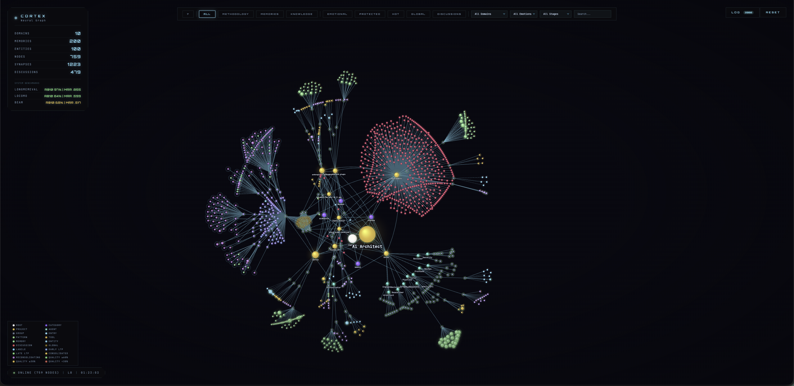
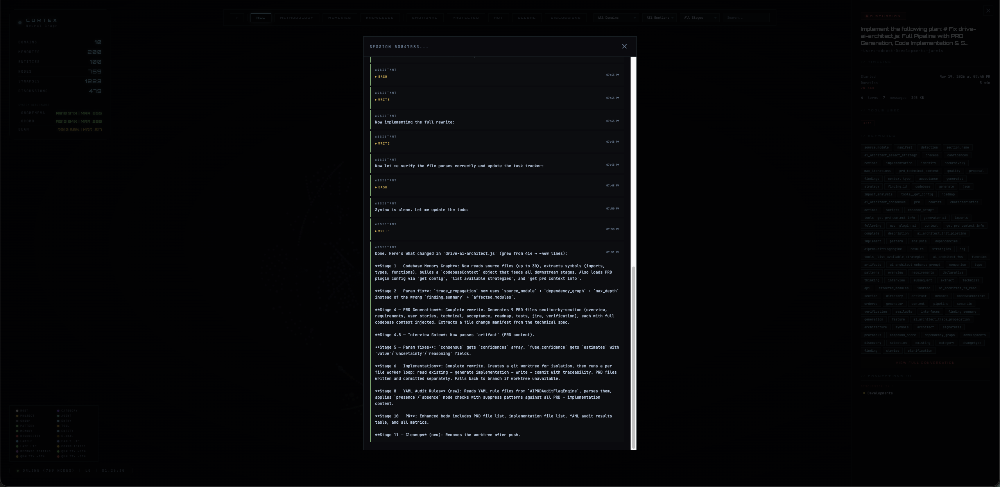
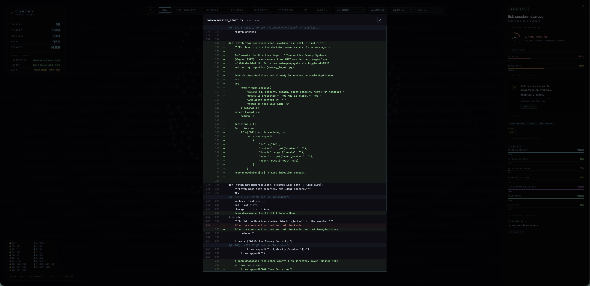
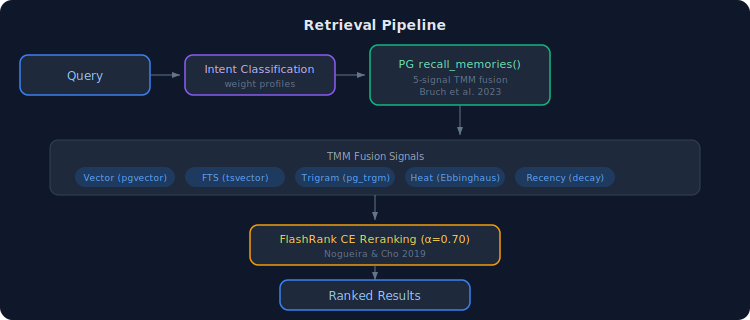
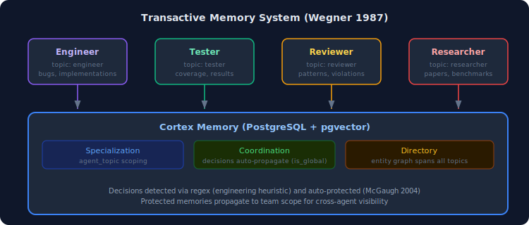
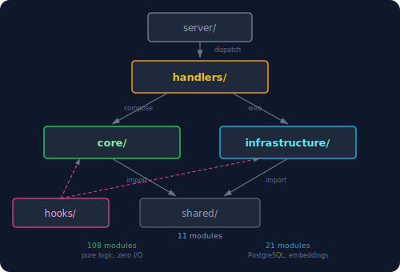

<div align="center">

# Cortex

### Persistent memory for Claude Code — built on neuroscience research, not guesswork

[](https://github.com/cdeust/Cortex/actions/workflows/ci.yml)
[](LICENSE)
[](https://python.org)
[](#development)

Memory that learns, consolidates, forgets intelligently, and surfaces the right context at the right time. Works standalone or with a team of specialized agents.

[How It Works](#how-it-works) | [Agent Integration](#agent-integration) | [Benchmarks](#benchmarks) | [Scientific Foundation](#scientific-foundation)

</div>

<p align="center">

</p>
<p align="center">


</p>

---

## How It Works

Cortex runs as an MCP server alongside Claude Code. It captures what you work on, consolidates it while you're away, and resurfaces the right context when you need it.

### Memory is Invisible

You don't manage memory. Cortex does.

**Session start** — hot memories, anchored decisions, and team context inject automatically. No manual recall needed.

**During work** — PostToolUse hooks capture significant actions (edits, commands, test results). Decisions are auto-detected and protected from forgetting. File edits prime related memories via spreading activation so they surface in subsequent recall.

**Session end** — a "dream" cycle runs automatically: decay old memories, compress verbose ones, and for long sessions, consolidate episodic memories into semantic knowledge (CLS).

**Between sessions** — memories cool naturally (Ebbinghaus forgetting curve). Important ones stay hot. Protected decisions never decay.

### Retrieval Pipeline

Five signals fused server-side in PostgreSQL, then reranked client-side:

<p align="center">

</p>

| Signal | Source | Paper |
|---|---|---|
| Vector similarity | pgvector HNSW (384-dim) | Bruch et al. 2023 |
| Full-text search | tsvector + ts_rank_cd | Bruch et al. 2023 |
| Trigram similarity | pg_trgm | Bruch et al. 2023 |
| Thermodynamic heat | Ebbinghaus decay model | Ebbinghaus 1885 |
| Recency | Exponential time decay | — |

### Hooks

Six hooks integrate with Claude Code's lifecycle:

| Hook | Event | What It Does |
|---|---|---|
| **SessionStart** | Session opens | Injects anchors + hot memories + team decisions + checkpoint |
| **PostToolUse** | After Edit/Write/Bash | Auto-captures significant actions as memories |
| **PostToolUse** | After Edit/Write/Read | Primes related memories via heat boost (spreading activation) |
| **SessionEnd** | Session closes | Runs dream cycle (decay, compress, CLS based on activity) |
| **Compaction** | Context compacts | Saves checkpoint; restores context after compaction |
| **SubagentStart** | Agent spawned | Briefs agent with prior work + team decisions |

---

## Agent Integration

Cortex is designed to work with a team of specialized agents. Each agent has scoped memory (`agent_topic`) while sharing critical decisions across the team.

### Transactive Memory System

Based on Wegner 1987: teams store more knowledge than individuals because each member specializes, and a shared directory tells everyone who knows what.

<p align="center">

</p>

**Specialization** — each agent writes to its own topic. Engineer's debugging notes don't clutter tester's recall.

**Coordination** — decisions auto-protect and propagate. When engineer decides "use Redis over Memcached," every agent sees it at next session start.

**Directory** — entity-based queries span all topics. "What do we know about the reranker?" returns results from engineer, tester, and researcher.

### Agent Briefing

When the orchestrator spawns a specialist agent, the SubagentStart hook automatically:

1. Extracts task keywords from the prompt
2. Queries agent-scoped prior work (FTS, no embedding load needed)
3. Fetches team decisions (protected + global memories from other agents)
4. Injects as context prefix — agent starts with knowledge

### Compatible Agent Team

Works with any custom Claude Code agents. See [zetetic-team-subagents](https://github.com/cdeust/zetetic-team-subagents) for a reference team of 11 specialists:

| Agent | Specialty | Memory Topic |
|---|---|---|
| orchestrator | Task decomposition, parallel dispatch | `orchestrator` |
| engineer | Implementation, any language/stack | `engineer` |
| tester | Testing, CI verification | `tester` |
| reviewer | Code review, architecture enforcement | `reviewer` |
| architect | System decomposition, refactoring | `architect` |
| dba | Database design, query optimization | `dba` |
| researcher | Benchmark improvement, paper research | `researcher` |
| frontend | React/TypeScript, component design | `frontend` |
| security | Threat modeling, vulnerability analysis | `security` |
| devops | CI/CD, Docker, deployment | `devops` |
| ux | Usability, accessibility, design systems | `ux` |

### Skills

Cortex ships as a Claude Code plugin with 14 skills:

| Skill | Command | What It Does |
|---|---|---|
| cortex-remember | `/cortex-remember` | Store a memory with full write gate |
| cortex-recall | `/cortex-recall` | Search memories with intent-adaptive retrieval |
| cortex-consolidate | `/cortex-consolidate` | Run maintenance (decay, compress, CLS) |
| cortex-explore-memory | `/cortex-explore-memory` | Navigate memory by entity/domain |
| cortex-navigate-knowledge | `/cortex-navigate-knowledge` | Traverse knowledge graph |
| cortex-debug-memory | `/cortex-debug-memory` | Diagnose memory system health |
| cortex-visualize | `/cortex-visualize` | Launch 3D neural graph in browser |
| cortex-profile | `/cortex-profile` | View cognitive methodology profile |
| cortex-setup-project | `/cortex-setup-project` | Bootstrap a new project |
| cortex-develop | `/cortex-develop` | Memory-assisted development workflow |
| cortex-automate | `/cortex-automate` | Create prospective triggers |

---

## Benchmarks

All scores are **retrieval-only** — no LLM reader in the evaluation loop. We measure whether retrieval places correct evidence in the top results.

| Benchmark | Metric | Cortex | Best in Paper | Paper |
|---|---|---|---|---|
| LongMemEval | R@10 | **98.0%** | 78.4% | Wang et al., ICLR 2025 |
| LongMemEval | MRR | **0.880** | — | |
| LoCoMo | R@10 | **97.7%** | — | Maharana et al., ACL 2024 |
| LoCoMo | MRR | **0.840** | — | |
| BEAM | Overall MRR | **0.627** | 0.329 (LIGHT) | Tavakoli et al., ICLR 2026 |

<details>
<summary>Per-category breakdowns</summary>

**BEAM (10 abilities, 400 questions)**

| Ability | MRR | R@10 |
|---|---|---|
| contradiction_resolution | 0.879 | 100.0% |
| knowledge_update | 0.867 | 97.5% |
| temporal_reasoning | 0.857 | 97.5% |
| multi_session_reasoning | 0.738 | 92.5% |
| information_extraction | 0.542 | 72.5% |
| summarization | 0.359 | 69.4% |
| preference_following | 0.356 | 62.5% |
| event_ordering | 0.353 | 62.5% |
| instruction_following | 0.242 | 52.5% |
| abstention | 0.125 | 12.5% |

**LongMemEval (6 categories, 500 questions)**

| Category | MRR | R@10 |
|---|---|---|
| Single-session (assistant) | 0.970 | 100.0% |
| Multi-session reasoning | 0.917 | 100.0% |
| Temporal reasoning | 0.887 | 97.7% |
| Knowledge updates | 0.884 | 100.0% |
| Single-session (user) | 0.793 | 91.4% |
| Single-session (preference) | 0.706 | 96.7% |

**LoCoMo (5 categories, 1986 questions)**

| Category | MRR | R@10 |
|---|---|---|
| adversarial | 0.809 | 89.0% |
| open_domain | 0.817 | 91.1% |
| multi_hop | 0.736 | 84.1% |
| single_hop | 0.714 | 91.8% |
| temporal | 0.538 | 76.1% |

</details>

---

## Architecture

Clean Architecture with strict dependency rules. Inner layers never import outer layers.

<p align="center">

</p>

| Layer | Modules | Rule |
|---|---|---|
| **core/** | 108 | Pure business logic. Zero I/O. Imports only `shared/`. |
| **infrastructure/** | 21 | All I/O: PostgreSQL, embeddings, file system. |
| **handlers/** | 33 tools | Composition roots wiring core + infrastructure. |
| **hooks/** | 6 | Lifecycle automation (SessionStart/End, PostToolUse, etc.) |
| **shared/** | 11 | Pure utilities. Python stdlib only. |

**Storage:** PostgreSQL 15+ with pgvector (HNSW) and pg_trgm. All retrieval in PL/pgSQL stored procedures.

---

## Scientific Foundation

### The Zetetic Standard

Every algorithm, constant, and threshold traces to a published paper, a measured ablation, or documented engineering source. Nothing is guessed. Where engineering defaults exist, they are labeled as such.

### Paper Index (41 citations)

<details>
<summary>Information Retrieval</summary>

| Paper | Year | Venue | Module |
|---|---|---|---|
| Bruch et al. "Fusion Functions for Hybrid Retrieval" | 2023 | ACM TOIS | `pg_schema.py` |
| Nogueira & Cho "Passage Re-ranking with BERT" | 2019 | arXiv | `reranker.py` |
| Joren et al. "Sufficient Context" | 2025 | ICLR | `reranker.py` |
| Collins & Loftus "Spreading-activation theory" | 1975 | Psych. Review | `spreading_activation.py` |

</details>

<details>
<summary>Neuroscience — Encoding (5 papers)</summary>

| Paper | Year | Module |
|---|---|---|
| Friston "A theory of cortical responses" | 2005 | `hierarchical_predictive_coding.py` |
| Bastos et al. "Canonical microcircuits for predictive coding" | 2012 | `hierarchical_predictive_coding.py` |
| Wang & Bhatt "Emotional modulation of memory" | 2024 | `emotional_tagging.py` |
| Doya "Metalearning and neuromodulation" | 2002 | `coupled_neuromodulation.py` |
| Schultz "Prediction and reward" | 1997 | `coupled_neuromodulation.py` |

</details>

<details>
<summary>Neuroscience — Consolidation (6 papers)</summary>

| Paper | Year | Module |
|---|---|---|
| Kandel "Molecular biology of memory storage" | 2001 | `cascade.py` |
| McClelland et al. "Complementary learning systems" | 1995 | `dual_store_cls.py` |
| Frey & Morris "Synaptic tagging" | 1997 | `synaptic_tagging.py` |
| Josselyn & Tonegawa "Memory engrams" | 2020 | `engram.py` |
| Dudai "The restless engram" | 2012 | `reconsolidation.py` |
| Borbely "Two-process model of sleep" | 1982 | `session_lifecycle.py` |

</details>

<details>
<summary>Neuroscience — Retrieval & Navigation (4 papers)</summary>

| Paper | Year | Module |
|---|---|---|
| Behrouz et al. "Titans: Learning to Memorize at Test Time" | 2025 | `titans_memory.py` |
| Stachenfeld et al. "Hippocampus as predictive map" | 2017 | `cognitive_map.py` |
| Ramsauer et al. "Hopfield Networks is All You Need" | 2021 | `hopfield.py` |
| Kanerva "Hyperdimensional computing" | 2009 | `hdc_encoder.py` |

</details>

<details>
<summary>Neuroscience — Plasticity & Maintenance (14 papers)</summary>

| Paper | Year | Module |
|---|---|---|
| Hasselmo "Hippocampal theta rhythm" | 2005 | `oscillatory_clock.py` |
| Buzsaki "Hippocampal sharp wave-ripple" | 2015 | `oscillatory_clock.py` |
| Leutgeb et al. "Pattern separation in dentate gyrus" | 2007 | `pattern_separation.py` |
| Yassa & Stark "Pattern separation in hippocampus" | 2011 | `pattern_separation.py` |
| Turrigiano "The self-tuning neuron" | 2008 | `homeostatic_plasticity.py` |
| Abraham & Bear "Metaplasticity" | 1996 | `homeostatic_plasticity.py` |
| Tse et al. "Schemas and memory consolidation" | 2007 | `schema_engine.py` |
| Gilboa & Marlatte "Neurobiology of schemas" | 2017 | `schema_engine.py` |
| Hebb *The Organization of Behavior* | 1949 | `synaptic_plasticity.py` |
| Bi & Poo "Synaptic modifications" | 1998 | `synaptic_plasticity.py` |
| Perea et al. "Tripartite synapses" | 2009 | `tripartite_synapse.py` |
| Kastellakis et al. "Synaptic clustering" | 2015 | `dendritic_clusters.py` |
| Wang et al. "Microglia-mediated synapse elimination" | 2020 | `microglial_pruning.py` |
| Ebbinghaus *Memory* | 1885 | `thermodynamics.py` |

</details>

<details>
<summary>Team Memory & Preemptive Retrieval (6 papers)</summary>

| Paper | Year | Module |
|---|---|---|
| Wegner "Transactive memory" | 1987 | `memory_ingest.py`, `session_start.py` |
| Zhang et al. "Collaboration Mechanisms for LLM Agents" | 2024 | `memory_ingest.py` |
| McGaugh "Amygdala modulates consolidation" | 2004 | `memory_ingest.py` |
| Adcock et al. "Reward-motivated learning" | 2006 | `memory_ingest.py` |
| Bar "The proactive brain" | 2007 | `preemptive_context.py` |
| Smith & Vela "Context-dependent memory" | 2001 | `agent_briefing.py` |

</details>

### Ablation Data

All ablation results committed to `benchmarks/beam/ablation_results.json`.

| Parameter | Tested Values | Optimal | Source |
|---|---|---|---|
| rerank_alpha | 0.30, 0.50, 0.55, 0.70 | **0.70** | BEAM 100K ablation |
| FTS weight | 0.0, 0.3, 0.5, 0.7, 1.0 | 0.0 (BEAM), 0.5 (balanced) | Cross-benchmark |
| Heat weight | 0.0, 0.1, 0.3, 0.5, 0.7 | 0.7 (BEAM), 0.3 (balanced) | Cross-benchmark |
| Adaptive alpha | CE spread QPP | **Rejected** | Regressed LoCoMo -5.1pp R@10 |

### Engineering Defaults

Values without paper backing, explicitly documented:

| Constant | Value | Location | Status |
|---|---|---|---|
| FTS weight | 0.5 | `pg_recall.py` | Balanced across benchmarks |
| Heat weight | 0.3 | `pg_recall.py` | Balanced across benchmarks |
| CE gate threshold | 0.15 | `reranker.py` | Engineering default |
| Titans eta/theta | 0.9/0.01 | `titans_memory.py` | Paper uses learned params |

---

## Development

```bash
pytest                    # 2068 tests
ruff check .              # Lint
ruff format --check .     # Format
```

---

## License

MIT

## Citation

```bibtex
@software{cortex2026,
  title={Cortex: Persistent Memory for Claude Code},
  author={Deust, Clement},
  year={2026},
  url={https://github.com/cdeust/Cortex}
}
```
</div>
