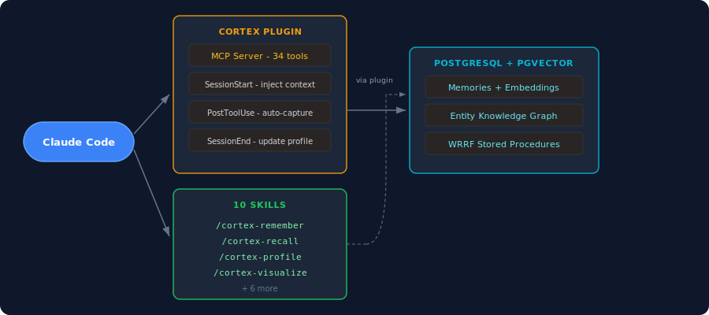
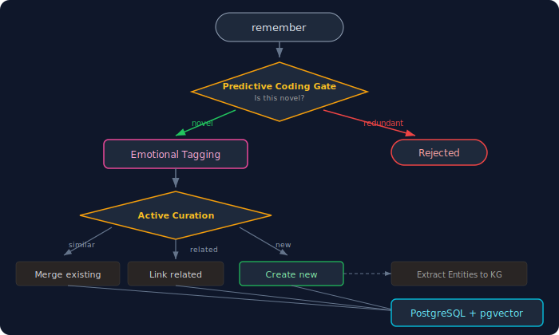
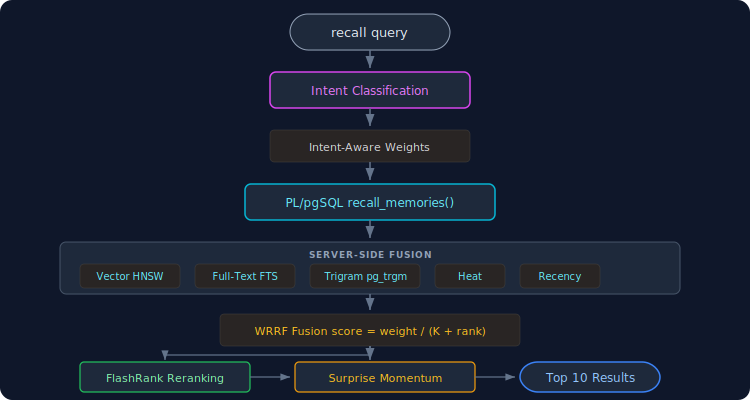
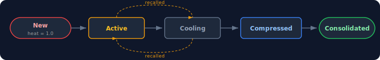
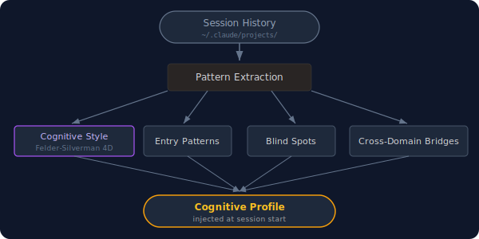
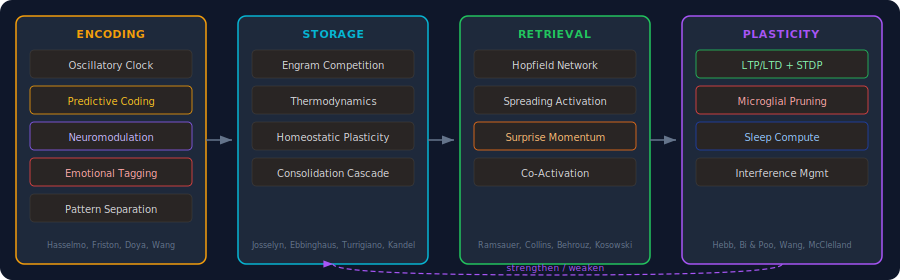

<div align="center">

# Cortex


### Persistent memory for Claude Code

[](https://github.com/cdeust/Cortex/actions/workflows/ci.yml)
[](LICENSE)
[](https://python.org)
[](https://modelcontextprotocol.io)
[](#development)
[](https://github.com/cdeust/Cortex/pulls)

**Claude Code forgets everything between sessions. Cortex fixes that.**

Install the plugin. Start talking. Cortex remembers your decisions, learns your patterns, and brings the right context back when you need it. No configuration required.

[Install in 2 minutes](#install) | [What you can do](#what-you-can-do) | [How it works](#how-it-works) | [Benchmarks](#benchmarks) | [Science](#the-science)

</div>

<p align="center">


</p>

---

## Install

### One-command setup (Claude Code, Cowork, VS Code)

```bash
claude plugin marketplace add cdeust/Cortex
claude plugin install cortex
```

That's it. Cortex registers its MCP server, installs 4 lifecycle hooks, and activates 10 skills. Restart Claude Code and you're running.

### What gets installed

| Component | What it does | Automatic? |
|---|---|---|
| **MCP Server** | 35 tools for memory, retrieval, profiling, codebase analysis | Yes |
| **SessionStart hook** | Injects hot memories + cognitive profile at session start | Yes |
| **SessionEnd hook** | Updates your cognitive profile after each session | Yes |
| **PostToolUse hook** | Auto-captures important tool outputs as memories | Yes |
| **Compaction hook** | Saves checkpoint before context window compaction | Yes |
| **10 Skills** | Workflow guides for every tool (invoke via `/cortex-*`) | Yes |

### Database setup

Cortex stores memories in PostgreSQL with pgvector for semantic search:

```bash
# macOS
brew install postgresql@17 pgvector
brew services start postgresql@17
createdb cortex
psql -d cortex -c "CREATE EXTENSION IF NOT EXISTS vector; CREATE EXTENSION IF NOT EXISTS pg_trgm;"
export DATABASE_URL=postgresql://localhost:5432/cortex
```

### Docker (zero setup, includes PostgreSQL)

Everything pre-installed: PostgreSQL 17 + pgvector, Python deps, sentence-transformers model cached, Claude Code CLI. Just mount your project and credentials.

```bash
# Build once
docker build -t cortex-runtime -f docker/Dockerfile .

# Run
docker run -it \
  -v /path/to/project:/workspace \
  -v ~/.claude:/home/cortex/.claude-host:ro \
  -v ~/.claude.json:/home/cortex/.claude-host-json/.claude.json:ro \
  cortex-runtime
```

Or with an OAuth token:

```bash
docker run -it \
  -v /path/to/project:/workspace \
  -e CLAUDE_CODE_OAUTH_TOKEN="$CLAUDE_CODE_OAUTH_TOKEN" \
  cortex-runtime
```

The container starts PostgreSQL, initializes the schema, configures the Cortex MCP server, and launches Claude Code with `--dangerously-skip-permissions` as a non-root user. Host credentials are mounted read-only — never modified.

### Alternative install methods

<details>
<summary>Claude Code CLI (no plugin)</summary>

```bash
claude mcp add cortex -- uvx neuro-cortex-memory
```

This registers the MCP server only. No hooks, no skills, no auto-capture.

</details>

<details>
<summary>From source</summary>

```bash
git clone https://github.com/cdeust/Cortex.git
cd Cortex
pip install -e ".[dev,postgresql]"
claude mcp add cortex -- python -m mcp_server
```

</details>

---

## What You Can Do

### 10 skills — invoke any with `/cortex-*`

| Skill | What it does | Example |
|---|---|---|
| `/cortex-remember` | Store decisions, fixes, patterns, lessons | *"Remember we chose JWT over sessions for auth"* |
| `/cortex-recall` | Search memories with intent-aware retrieval | *"Why did we switch databases?"* |
| `/cortex-explore-memory` | Check memory health, find gaps, assess coverage | *"What do we know about the payment module?"* |
| `/cortex-consolidate` | Run maintenance: decay, compress, merge | *"Clean up old memories"* |
| `/cortex-profile` | View cognitive style, patterns, blind spots | *"Show my work patterns"* |
| `/cortex-navigate-knowledge` | Trace relationships, explore causal chains | *"How does auth relate to billing?"* |
| `/cortex-setup-project` | Bootstrap memory from code or import history | *"Set up Cortex for this project"* |
| `/cortex-visualize` | Launch 3D neural graph or memory dashboard | *"Show me the memory map"* |
| `/cortex-automate` | Create triggers, rules, sync to CLAUDE.md | *"Remind me about X when I open that file"* |
| `/cortex-debug-memory` | Fix bad memories, rate quality, restore checkpoints | *"That memory is wrong, delete it"* |

### Codebase analysis

Cortex can index your codebase directly into memory — replacing external tools like GitNexus.

```bash
# From any Claude Code session:
codebase_analyze(directory="/path/to/project")
```

| Feature | What it does |
|---|---|
| **Tree-sitter AST parsing** | Extracts imports, classes, functions, methods for Python, TypeScript, Go, Swift, Rust (regex fallback for others) |
| **Cross-file import resolution** | `from auth.tokens import verify_jwt` resolves to the actual file defining it |
| **Type-reference resolution** | For Swift/Go where files reference types without explicit imports |
| **Class-method binding** | Methods scoped to parent class (`AuthService.validate`, not just `validate`) |
| **Inheritance tracking** | `class Child(Parent)` creates "extends" edges in the knowledge graph |
| **Community detection** | Louvain clustering groups functionally related files |
| **Impact analysis** | Upstream/downstream BFS — "what breaks if I change this file?" |
| **Incremental** | SHA-256 hash per file, only re-processes changed files |

Every file becomes a semantic memory. Every symbol becomes an entity. Every import and type reference becomes a relationship edge. All queryable via `recall("how does authentication work")`.

### What happens automatically (no skill needed)

**At session start** — Cortex injects your hottest memories, fired triggers, and cognitive profile. You get context without asking.

**During the session** — The PostToolUse hook captures significant outputs (bug fixes, file edits, test results) as memories automatically. The predictive coding gate filters noise.

**At session end** — Your cognitive profile updates with what you did, how you worked, and what tools you used.

**On context compaction** — A checkpoint saves your working state so nothing is lost when the context window compresses.

### Quick examples

**Remember a decision:**
> "Remember that we're using PostgreSQL instead of MongoDB for the auth service because we need ACID transactions"

**Recall with context:**
> "What did we decide about the database for auth?" — Cortex detects causal intent, boosts entity graph signals, returns the decision with reasoning

**Get proactive context:**
> Start a session in a project you haven't touched in 2 weeks — Cortex surfaces what you were working on, what decisions were pending, and what patterns it noticed

**Import your history:**
> `/cortex-setup-project` — backfill memories from all your past Claude Code conversations across every project

---

## How It Works

### The big picture

<p align="center">

</p>

### Memory write path

When you say "remember this" or the auto-capture hook fires:

<p align="center">
 Predictive Coding Gate (novel/redundant) -> Emotional Tagging -> Active Curation (merge/link/create) -> PostgreSQL" width="100%"/>
</p>

The 4-signal write gate compares embedding distance, entity overlap, temporal proximity, and structural similarity against existing memories. Only genuinely novel content passes through.

### Memory read path

When you ask a question or the session-start hook fires:

<p align="center">
 Intent Classification -> PL/pgSQL recall_memories() -> 5-signal WRRF fusion -> FlashRank Reranking -> Surprise Momentum -> Top 10 Results" width="100%"/>
</p>

The system classifies your query intent first, then adjusts which signals matter most. A "when did we..." question boosts recency; a "why did we..." question boosts causal graph traversal.

### Memory lifecycle

Memories aren't static. They heat up when accessed, cool down over time, compress when old, and consolidate from episodic (specific events) into semantic (general knowledge):

<p align="center">
 Active -> Cooling -> Compressed -> Consolidated, with recall loops back to Active" width="100%"/>
</p>

### Cognitive profiling

Cortex builds a profile of how you work — from your Claude Code session history:

<p align="center">
 Pattern Extraction -> Cognitive Style, Entry Patterns, Blind Spots, Cross-Domain Bridges -> Cognitive Profile" width="100%"/>
</p>

---

## 35 MCP Tools

<details>
<summary>Full tool reference</summary>

### Memory (8 tools)

| Tool | What it does |
|---|---|
| `remember` | Store a memory through the predictive coding write gate |
| `recall` | Retrieve via 5-signal WRRF fusion + FlashRank reranking |
| `consolidate` | Run decay, compression, CLS consolidation, sleep compute |
| `checkpoint` | Save/restore working state across context compaction |
| `memory_stats` | Memory system diagnostics |
| `narrative` | Generate project story from stored memories |
| `import_sessions` | Import conversation history into memory |
| `open_memory_dashboard` | Launch real-time memory heatmap dashboard |

### Navigation (5 tools)

| Tool | What it does |
|---|---|
| `recall_hierarchical` | Fractal L0/L1/L2 hierarchy with drill-down |
| `drill_down` | Navigate into a fractal cluster |
| `navigate_memory` | Co-access graph traversal (Successor Representation) |
| `get_causal_chain` | Trace entity relationships through the knowledge graph |
| `detect_gaps` | Find isolated entities, sparse domains, temporal drift |

### Management (6 tools)

| Tool | What it does |
|---|---|
| `forget` | Hard/soft delete with protection guard |
| `anchor` | Mark as compaction-resistant (heat=1.0, permanent) |
| `rate_memory` | Useful/not-useful feedback for metamemory |
| `validate_memory` | Check memories against current filesystem state |
| `backfill_memories` | Auto-import prior Claude Code conversations |
| `seed_project` | Bootstrap memory from codebase structure |
| `codebase_analyze` | Tree-sitter AST analysis with cross-file resolution |

### Profiling (8 tools)

| Tool | What it does |
|---|---|
| `query_methodology` | Load cognitive profile + hot memories for session |
| `detect_domain` | Classify current domain from working directory |
| `rebuild_profiles` | Full rescan of all session history |
| `list_domains` | Overview of all tracked project domains |
| `record_session_end` | Incremental profile update + session critique |
| `explore_features` | Behavioral interpretability (features, persona, attribution) |
| `get_methodology_graph` | Graph data for visualization |
| `open_visualization` | Launch 3D neural graph in browser |

### Automation (7 tools)

| Tool | What it does |
|---|---|
| `sync_instructions` | Push top memory insights into CLAUDE.md |
| `create_trigger` | Prospective memory triggers (keyword/time/file/domain) |
| `add_rule` | Add neuro-symbolic rules (hard/soft/tag) |
| `get_rules` | List active rules by scope |
| `get_project_story` | Period-based autobiographical narrative |
| `assess_coverage` | Knowledge coverage score (0-100) + recommendations |
| `run_pipeline` | Drive ai-architect pipeline end-to-end |

</details>

---

## Agents

Cortex supports 11 specialized agents, each with memory-scoped knowledge. The orchestrator decomposes tasks and spawns specialists in parallel worktrees.

<details>
<summary>Agent roster</summary>

| Agent | Role | Memory scope |
|---|---|---|
| **Orchestrator** | Decomposes tasks, spawns agents, merges results | Project story, entity chains, gaps |
| **Engineer** | Clean Architecture, SOLID, root-cause fixes | Past implementations, causal chains |
| **Tester** | Test strategy, coverage, fragile modules | Past failures, wiring gaps |
| **Reviewer** | Code review, ADR enforcement | Review feedback, accepted trade-offs |
| **UX** | Design rationale, accessibility | UX decisions, user constraints |
| **Frontend** | Component architecture, integration | Existing components, patterns |
| **Security** | Threat models, risk acceptance | Prior findings, data flows |
| **Researcher** | Paper reviews, benchmarks | Papers reviewed, benchmark history |
| **DBA** | Schema design, query optimization | Schema decisions, perf issues |
| **DevOps** | Infrastructure, incidents, deployments | Infra decisions, postmortems |
| **Architect** | ADRs, decomposition, refactoring | ADRs, decomposition plans |

Each agent uses `agent_topic` scoping — a **soft boost** that promotes topic-relevant memories during retrieval without hiding cross-topic knowledge. Validated empirically: hard filtering destroyed precision (-0.101 MRR), soft boosting is neutral-to-positive (-0.001 MRR).

</details>

---

## Visualization

```bash
# From any Claude Code session:
/cortex-visualize    # or directly:
# cortex:open_visualization    — 3D neural graph at localhost:3458
# cortex:open_memory_dashboard — Memory heatmap at localhost:3457
```

The graph organizes everything into a 6-level hierarchy — from broad categories down to individual memories and entities. Node size reflects importance, glow reflects heat (recency), and colored arcs show quality scores. Auto-shuts down after 10 minutes idle.

<details>
<summary>Visual encoding reference</summary>

| Node type | Color | Represents |
|---|---|---|
| Domain | Gold | A project you work in |
| Memory (episodic) | Mint green | A specific event or conversation |
| Memory (semantic) | Magenta | Abstracted knowledge |
| Entity | Cyan/Blue/Red | Extracted element (function, dependency, error) |
| Entry point | Cyan | How you start work in a domain |
| Recurring pattern | Green | Behavioral pattern across sessions |
| Behavioral feature | Purple | Learned feature from sparse dictionary |

| Visual | Meaning |
|---|---|
| Node size | Importance (session volume, access frequency, heat) |
| Glow intensity | Thermodynamic heat (bright = recent, dim = cold) |
| Quality arc | Colored ring: green (>60%), amber (30-60%), red (<30%) |
| Pulsing ring | Emotional arousal |
| Edge width | Relationship strength |
| Edge particles | Animated dots on selected node's connections |

| Interaction | Effect |
|---|---|
| Click node | Select, show details, highlight neighbors |
| Scroll | Zoom through 4 fractal levels |
| Filter buttons | All, Methodology, Memories, Knowledge, Hot |
| Search bar | Full-text search across labels and content |
| `M` key | Toggle activity monitor |
| `R` key | Reset view |
| `?` key | Open glossary |

</details>

---

## Benchmarks

7 benchmarks spanning 2024-2026, all running on the **production PostgreSQL backend** — same `recall_memories()` stored procedure, same FlashRank reranking. No custom retrievers.

### Results

| Benchmark | Cortex | Best in paper | Delta |
|---|---|---|---|
| **LongMemEval R@10** (ICLR 2025) | **98.0%** | 78.4% | **+19.6pp** |
| **LongMemEval MRR** | **0.880** | -- | -- |
| **LoCoMo R@10** (ACL 2024) | **88.9%** | -- | -- |
| **LoCoMo MRR** | **0.774** | -- | -- |
| **BEAM Overall MRR** (ICLR 2026) | **0.515** | 0.329 | **+57%** |
| **Spell Alteration** (1.5M token haystack) | **5/5 PASS** | -- | -- |

### Why retrieval-only metrics?

Every score above is **retrieval-only** — no LLM reader in the evaluation loop. We measure one thing: *did the retrieval system place the correct evidence in the top results?*

Most memory systems report full QA scores — retrieve context, feed to GPT-4/Claude, judge the answer. This conflates retrieval quality with reader model strength. A powerful reader can compensate for broken retrieval by reasoning over vaguely related context.

We report two standard metrics:
- **Recall@K**: What fraction of questions had correct evidence *anywhere* in the top K?
- **MRR (Mean Reciprocal Rank)**: *Where* in the ranked list does the first correct result appear? MRR 0.880 means it's typically the first or second result.

High retrieval MRR guarantees high QA with any competent reader. High QA does *not* guarantee high retrieval. [See detailed methodology explanation.](#retrieval-methodology)

<details>
<summary>LongMemEval per-category breakdown</summary>

| Category | MRR | R@10 |
|---|---|---|
| Single-session (user) | 0.793 | 91.4% |
| Single-session (assistant) | 0.970 | 100.0% |
| Single-session (preference) | 0.706 | 96.7% |
| Multi-session reasoning | 0.917 | 100.0% |
| Temporal reasoning | 0.887 | 97.7% |
| Knowledge updates | 0.884 | 100.0% |

</details>

<details>
<summary>LoCoMo per-category breakdown</summary>

| Category | MRR | R@5 | R@10 |
|---|---|---|---|
| single_hop | 0.714 | 85.5% | 91.8% |
| multi_hop | 0.736 | 82.2% | 84.1% |
| temporal | 0.538 | 65.2% | 76.1% |
| open_domain | 0.817 | 88.8% | 91.1% |
| adversarial | 0.809 | 87.0% | 89.0% |

</details>

<details>
<summary>BEAM per-ability breakdown</summary>

| Ability | Cortex | LIGHT | Delta |
|---|---|---|---|
| contradiction_resolution | **0.892** | 0.050 | **+1684%** |
| temporal_reasoning | **0.789** | 0.075 | **+952%** |
| knowledge_update | **0.826** | 0.375 | **+120%** |
| multi_session_reasoning | **0.737** | 0.000 | -- |
| information_extraction | **0.519** | 0.375 | **+38%** |
| preference_following | 0.410 | **0.483** | -15% |
| event_ordering | **0.326** | 0.266 | **+23%** |
| summarization | **0.311** | 0.277 | **+12%** |
| instruction_following | 0.218 | **0.500** | -56% |
| abstention | 0.125 | **0.750** | -83% |

Cortex dominates 7/10 abilities. The three where LIGHT leads (preference, instruction, abstention) expose genuine retrieval challenges: abstention requires knowing what was *never discussed*, instruction following requires surfacing directives across 100K tokens of noise.

</details>

<details>
<summary>Spell Alteration benchmark</summary>

Needle-in-a-haystack memory fidelity test. Ingests a complete 1.5M-token novel as 3000+ memories, replaces 2 specific terms with fakes throughout the entire corpus, then tests recall precision.

**Test A (Easy):** Ingest altered story. Can the system find the 2 fake terms among 3372 memories and confirm the originals are absent?

**Test B (Hard):** Ingest BOTH the original and altered versions (6744 total memories, ~3.1M tokens). Compare them from memory alone: identify which terms were removed, which fakes were added, and correctly pair each original to its replacement.

| Test | Result | What it proves |
|---|---|---|
| A1 — Fake terms retrievable | **PASS** | Both fakes found in 3372-memory haystack |
| A2 — Original terms absent | **PASS** | Both originals confirmed gone from corpus |
| B1 — Identified removed terms | **PASS** | Correctly identified which 2 terms disappeared |
| B2 — Identified fake terms | **PASS** | Correctly identified which 2 new terms appeared |
| B3 — Correct original-to-fake pairing | **PASS** | Matched each original to its replacement via context overlap |

Haystack: 6744 memories (~3.1M tokens). Total time: ~208s on Apple Silicon.

**Note:** The benchmark requires a user-provided PDF (not included for copyright reasons). See [Reproduce](#reproduce) for instructions.

</details>

### Reproduce

```bash
pip install sentence-transformers flashrank datasets

# LongMemEval (~19 min)
curl -sL -o benchmarks/longmemeval/longmemeval_s.json \
  "https://huggingface.co/datasets/xiaowu0162/LongMemEval/resolve/main/longmemeval_s"
DATABASE_URL=postgresql://localhost:5432/cortex python3 benchmarks/longmemeval/run_benchmark.py --variant s

# LoCoMo (~24 min)
curl -sL -o benchmarks/locomo/locomo10.json \
  "https://huggingface.co/datasets/Percena/locomo-mc10/resolve/main/raw/locomo10.json"
DATABASE_URL=postgresql://localhost:5432/cortex python3 benchmarks/locomo/run_benchmark.py

# BEAM (~5 min, auto-downloads)
DATABASE_URL=postgresql://localhost:5432/cortex python3 benchmarks/beam/run_benchmark.py --split 100K

# Spell Alteration (~4 min, requires user-provided PDF)
# Provide any long-form PDF (1M+ tokens recommended)
pip install pymupdf
DATABASE_URL=postgresql://localhost:5432/cortex python3 benchmarks/spell_alteration/run_benchmark.py --pdf /path/to/your/book.pdf
```

---

## The Science

Cortex implements 23 neuroscience-inspired mechanisms, each grounded in published research. This isn't metaphor — the computational models follow the papers' equations and algorithms, adapted to a memory system operating at hours/days timescale.

### Why neuroscience?

Biological memory solves the exact problems we face: storing selectively (not everything), retrieving by relevance (not recency alone), forgetting gracefully (not all-or-nothing), and consolidating over time (episodic events become general knowledge). Evolution spent 500 million years optimizing these mechanisms. We implement their computational models.

### Test-time learning (Titans + Dragon Hatchling)

The biggest innovation: the retrieval system **learns from its own queries**.

- **Surprise momentum** (Behrouz et al., NeurIPS 2025 — Titans): After each recall, compute `surprise = 1 - mean(cosine_sim(query, results))`. Surprising results get a heat boost; redundant ones get suppressed. An EMA momentum term amplifies the effect. This single mechanism improved LongMemEval R@10 from 90.4% to **98.0%** (+7.6pp).

- **Co-activation strengthening** (Kosowski et al., 2025 — Dragon Hatchling): When memories A and B are co-retrieved, their entity edges get Hebbian reinforcement: `weight += lr * score_product`. The knowledge graph learns from usage patterns.

- **Adaptive decay** (Behrouz et al., NeurIPS 2025 — Titans): Per-memory decay rates computed from `access_count`, `useful_count`, and `surprise_score`. Useful memories decay slower (0.999/hr); redundant ones faster (0.90/hr).

### Server-side WRRF fusion

All retrieval runs in a single PL/pgSQL stored procedure. Five signals fused server-side with Weighted Reciprocal Rank Fusion:

| Signal | Source | What it captures |
|---|---|---|
| **Vector** | pgvector HNSW (384-dim) | Semantic similarity |
| **FTS** | tsvector + ts_rank_cd | Keyword matching |
| **Trigram** | pg_trgm similarity | Fuzzy/partial matching |
| **Heat** | Thermodynamic model | Importance + recency |
| **Recency** | Timestamp decay | Temporal relevance |

Intent classification adjusts signal weights per query: temporal queries boost recency, causal queries boost spreading activation, entity queries boost BM25/FTS.

### Biological mechanisms

<p align="center">

</p>

<details>
<summary>Full mechanism reference with paper citations</summary>

| Mechanism | Module | Paper | What it does |
|---|---|---|---|
| Surprise Momentum | `thermodynamics.py` | Behrouz et al. 2025 (Titans) | Test-time learning: retrieval surprise -> heat modulation via EMA momentum |
| Adaptive Decay | `decay_cycle.py` | Behrouz et al. 2025 (Titans) | Per-memory decay rates from access/useful/surprise signals |
| Co-Activation | `pg_store_relationships.py` | Kosowski et al. 2025 (Dragon Hatchling) | Hebbian reinforcement of entity edges from co-retrieval |
| Hierarchical Predictive Coding | `hierarchical_predictive_coding.py` | Friston 2005, Bastos 2012 | 3-level free energy gate (sensory/entity/schema) |
| Coupled Neuromodulation | `coupled_neuromodulation.py` | Doya 2002, Schultz 1997 | DA/NE/ACh/5-HT coupled cascade with cross-channel effects |
| Oscillatory Clock | `oscillatory_clock.py` | Hasselmo 2005, Buzsaki 2015 | Theta/gamma/SWR phase gating for encoding/retrieval |
| Consolidation Cascade | `cascade.py` | Kandel 2001, Dudai 2012 | LABILE -> EARLY_LTP -> LATE_LTP -> CONSOLIDATED |
| Pattern Separation | `pattern_separation.py` | Leutgeb 2007, Yassa & Stark 2011 | DG orthogonalization + neurogenesis analog |
| Schema Engine | `schema_engine.py` | Tse 2007, Gilboa & Marlatte 2017 | Cortical knowledge structures with Piaget accommodation |
| Tripartite Synapse | `tripartite_synapse.py` | Perea 2009, De Pitta 2012 | Astrocyte calcium dynamics, D-serine LTP facilitation |
| Interference Management | `interference.py` | Wixted 2004 | Proactive/retroactive detection + sleep orthogonalization |
| Homeostatic Plasticity | `homeostatic_plasticity.py` | Turrigiano 2008, Abraham & Bear 1996 | Synaptic scaling + BCM sliding threshold |
| Dendritic Clusters | `dendritic_clusters.py` | Kastellakis 2015 | Branch-specific nonlinear integration + priming |
| Two-Stage Model | `two_stage_model.py` | McClelland 1995, Kumaran 2016 | Hippocampal fast-bind -> cortical slow-integrate |
| Emotional Tagging | `emotional_tagging.py` | Wang & Bhatt 2024 | Amygdala-inspired priority encoding with Yerkes-Dodson curve |
| Synaptic Tagging | `synaptic_tagging.py` | Frey & Morris 1997 | Retroactive promotion of weak memories sharing entities |
| Engram Competition | `engram.py` | Josselyn & Tonegawa 2020 | CREB-like excitability slots |
| Thermodynamics | `thermodynamics.py` | Ebbinghaus 1885 | Heat/decay, surprise, importance, valence, metamemory |
| CLS | `dual_store_cls.py` | McClelland 1995 | Episodic -> semantic consolidation |
| Hopfield Network | `hopfield.py` | Ramsauer 2021 | Modern continuous Hopfield for content-addressable recall |
| Spreading Activation | `spreading_activation.py` | Collins & Loftus 1975 | Entity graph priming via recursive CTE in PL/pgSQL |
| HDC Encoding | `hdc_encoder.py` | Kanerva 2009 | 1024-dim bipolar hypervectors |
| Successor Representation | `cognitive_map.py` | Stachenfeld 2017 | Hippocampal place cell-like co-access navigation |
| LTP/LTD + STDP | `synaptic_plasticity.py` | Hebb 1949, Bi & Poo 1998 | Hebbian plasticity + spike-timing-dependent causal direction |
| Microglial Pruning | `microglial_pruning.py` | Wang et al. 2020 | Complement-dependent edge elimination + orphan archival |
| Ablation Framework | `ablation.py` | -- | Lesion study simulator for 23 mechanisms |

</details>

### Retrieval methodology

<a id="retrieval-methodology"></a>

Every benchmark score is **retrieval-only**. There is no LLM reader in the evaluation loop.

Most memory systems report full QA scores — retrieve context, feed to a powerful reader (GPT-4, Claude), judge the answer. This conflates retrieval quality with reader model strength. A strong reader compensates for broken retrieval by reasoning over vaguely related context, or drawing on parametric knowledge while ignoring the retrieved context entirely.

The relationship is asymmetric:
- **High retrieval MRR guarantees high QA.** If correct evidence is consistently at rank 1, any competent reader answers correctly.
- **High QA does *not* guarantee high retrieval.** A system can score well on QA while retrieval is broken, as long as the reader is strong enough.

This is not theoretical. On BEAM, one comparable system reports full-QA instruction_following of 0.750 with Claude Opus as reader — but their retrieval MRR for that category is **0.086**. The retrieval finds the correct instruction less than 9% of the time. The 0.750 is almost entirely the reader reasoning its way to the answer despite wrong context. Cortex's retrieval MRR of 0.218 on the same category means the retrieval itself is 2.5x better — a property that holds regardless of downstream reader.

---

## Architecture

Clean Architecture with concentric dependency layers. Inner layers never import outer layers.

<p align="center">
 handlers -> core (108 modules) + infrastructure (21 modules) -> shared (11 modules), with hooks using core and infrastructure" width="100%"/>
</p>

| Component | Count | Description |
|---|---|---|
| Core modules | 108 | Pure business logic, zero I/O |
| Handlers | 60 | Composition roots wiring core + infrastructure |
| Infrastructure | 21 | PostgreSQL + pgvector, embeddings, file I/O |
| Shared | 11 | Pure utilities and Pydantic types |
| Hooks | 4 | Session lifecycle, compaction, auto-capture |
| Tests | 2000+ | Passing across Python 3.10-3.13 |
| Benchmarks | 7 | LongMemEval, LoCoMo, BEAM, Spell Alteration, and 3 more |

---

## Configuration

All settings via environment variables with `CORTEX_MEMORY_` prefix:

| Variable | Default | Description |
|---|---|---|
| `DATABASE_URL` | `postgresql://localhost:5432/cortex` | PostgreSQL connection (mandatory) |
| `CORTEX_MEMORY_DECAY_FACTOR` | `0.95` | Base heat decay rate per hour |
| `CORTEX_MEMORY_SURPRISE_MOMENTUM_ENABLED` | `true` | Enable test-time learning |
| `CORTEX_MEMORY_SURPRISE_MOMENTUM_ETA` | `0.7` | Momentum decay (EMA) |
| `CORTEX_MEMORY_ADAPTIVE_DECAY_ENABLED` | `true` | Per-memory adaptive decay rates |
| `CORTEX_MEMORY_CO_ACTIVATION_ENABLED` | `true` | Hebbian co-retrieval strengthening |
| `CORTEX_MEMORY_WRRF_VECTOR_WEIGHT` | `1.0` | Vector signal weight in WRRF |
| `CORTEX_MEMORY_WRRF_FTS_WEIGHT` | `0.5` | FTS signal weight |
| `CORTEX_MEMORY_WRRF_HEAT_WEIGHT` | `0.3` | Heat signal weight |

---

## Development

```bash
# Run tests
pytest

# Run with coverage
pytest --cov=mcp_server --cov-report=term-missing

# Run specific layer
pytest tests_py/core/
pytest tests_py/handlers/

# Run benchmarks (requires PostgreSQL)
DATABASE_URL=postgresql://localhost:5432/cortex python3 benchmarks/longmemeval/run_benchmark.py --variant s
```

### Docker development

```bash
# Build image (~5 min first time, cached after)
docker build -t cortex-runtime -f docker/Dockerfile .

# Interactive shell inside container
docker run -it \
  -v $(pwd):/workspace \
  -v ~/.claude:/home/cortex/.claude-host:ro \
  -v ~/.claude.json:/home/cortex/.claude-host-json/.claude.json:ro \
  cortex-runtime shell

# Run a single prompt
docker run --rm \
  -v /path/to/project:/workspace \
  -v ~/.claude:/home/cortex/.claude-host:ro \
  -v ~/.claude.json:/home/cortex/.claude-host-json/.claude.json:ro \
  cortex-runtime -p "recall what we decided about the database"
```

Image includes: PostgreSQL 17 + pgvector, Python 3.12, all deps, sentence-transformers model (4.9GB total, CPU-only PyTorch).

## Contributing

Contributions welcome. Please open an issue first to discuss what you'd like to change. See [Architecture](#architecture) for dependency rules.

## Citation

```bibtex
@software{cortex2026,
  title={Cortex: Biologically-Inspired Persistent Memory for Claude Code},
  author={Deust, Clement},
  year={2026},
  url={https://github.com/cdeust/Cortex}
}
```

## License

MIT
