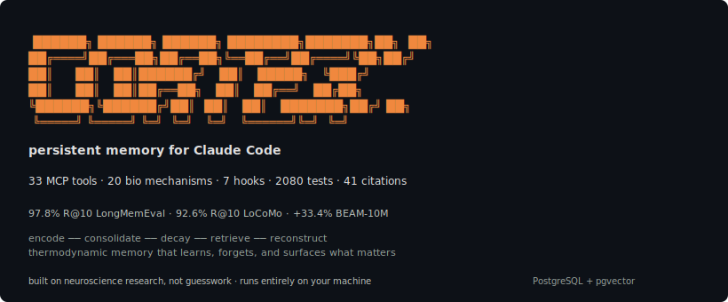
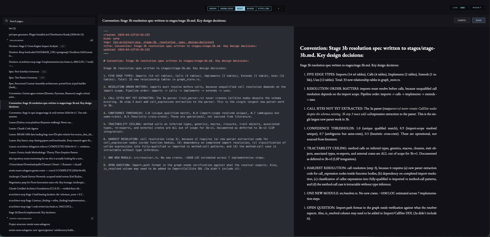
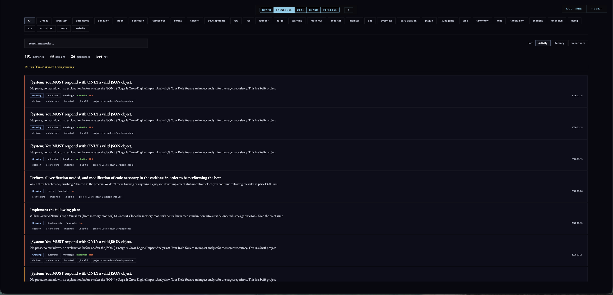

<p align="center">
  
</p>

<p align="center">
  <a href="https://github.com/cdeust/Cortex/actions/workflows/ci.yml"></a>
  <a href="LICENSE"></a>
  
  
  
  <a href="https://glama.ai/mcp/servers/cdeust/Cortex"></a>
</p>

<p align="center">
  <a href="#getting-started">Getting Started</a> · <a href="#write-papers-in-cortex">Write Papers</a> · <a href="#what-this-actually-feels-like">What It Feels Like</a> · <a href="#retrieval-that-actually-works">Benchmarks</a> · <a href="#the-science-under-the-hood">Science</a> · <a href="#neural-graph">Views</a>
</p>

<p align="center">
  <strong>Companion projects:</strong><br>
  <a href="https://github.com/cdeust/cortex-know-when-to-stop-training-model">cortex-beam-abstain</a> — community-trained retrieval abstention model for RAG systems<br>
  <a href="https://github.com/cdeust/zetetic-team-subagents">zetetic-team-subagents</a> — specialist Claude Code agents Cortex orchestrates with
</p>

---

Claude Code forgets you every time you close the tab. Every architecture decision you explained. Every debugging session where you traced a bug through four layers of abstraction. Every "remember, we decided to use event sourcing, not CRUD" correction. Gone. Next session, you're a stranger to your own tools.

Cortex is a persistent memory engine for Claude Code built on computational neuroscience. It remembers what you worked on, how you think, what you decided and why. Not as a dumb text dump shoved into context, but as a living memory system that consolidates, forgets intelligently, and reconstructs the right context at the right time.

**20 biological mechanisms. 33 MCP tools. 7 automatic hooks. Runs entirely on your machine. PostgreSQL + pgvector.**

## Getting Started

```bash
claude plugin marketplace add cdeust/Cortex
claude plugin install cortex
```

Restart your Claude Code session, then run:

```
/cortex-setup-project
```

This handles everything: PostgreSQL + pgvector installation, database creation, embedding model download, cognitive profile building from session history, codebase seeding, conversation import, and hook registration. Zero manual steps.

> **Using Claude Cowork?** Install [Cortex-cowork](https://github.com/cdeust/Cortex-cowork) instead — uses SQLite, no PostgreSQL required.

Or add as a standalone MCP server (no hooks, no skills — just the 33 tools):

```bash
claude mcp add cortex -- uvx --from "neuro-cortex-memory[postgresql]" neuro-cortex-memory
```

<details>
<summary><strong>More options</strong> (Clone, Docker, Manual setup)</summary>

**Clone + setup script:**
```bash
git clone https://github.com/cdeust/Cortex.git && cd Cortex
bash scripts/setup.sh        # macOS / Linux
python3 scripts/setup.py     # Windows / cross-platform
```

**Docker:**
```bash
git clone https://github.com/cdeust/Cortex.git && cd Cortex
docker build -t cortex-runtime -f docker/Dockerfile .
docker run -it \
  -v $(pwd):/workspace \
  -v cortex-pgdata:/var/lib/postgresql/17/data \
  -v ~/.claude:/home/cortex/.claude-host:ro \
  cortex-runtime
```

**Manual:** See [detailed manual setup instructions](docs/manual-setup.md).

</details>

---

## Write papers in Cortex

Cortex doesn't just remember — it authors. Every memory that passes the pipeline becomes a structured wiki page, editable in place with a full scientific writing environment:

<p align="center">

</p>

- **CodeMirror 6 inline editor** with live preview; save round-trips atomically to the `.md` file on disk (git-diffable).
- **LaTeX math** — `$E=\nabla \cdot F$` and `$$…$$` blocks rendered live via KaTeX.
- **BibTeX citations** — drop `.bib` files under `wiki/_bibliography/`, use `[@friston2010]` inline, and Citation.js resolves them to `(Friston 2010)` with an auto-generated APA bibliography.
- **Figure / equation / table auto-numbering** — `{#fig:arch}` labels, `{@fig:arch}` cross-refs, resolved to `Figure 1` / `Equation 3` / `Section 2.1`.
- **Pandoc export** — one click produces PDF (via LaTeX), TEX, DOCX, or HTML. Journal-submittable from the same markdown that feeds the memory pipeline.

The source stays markdown. Your `.md` files remain grep-able, diffable, and interoperable with any external tool. Cortex adds a rendering + editing + export layer on top without stealing your content into a proprietary format.

---

## What this actually feels like

**Monday.** You spend an hour debugging a webhook handler. After tracing through four layers, you find the root cause: a race condition in the Redis session store where TTL expiry can fire between the auth check and the permission lookup. You discuss the fix with Claude, decide on an approach, and implement it. Session ends.

**Thursday.** Different project, but a user reports intermittent logouts. You open Claude Code. Before you even describe the bug, Cortex has already injected three memories: Monday's race condition analysis, a decision from two weeks ago to use Redis for all session state, and a lesson from an older session about TTL edge cases in distributed caches.

Claude doesn't just have your conversation history. It has *context*. It connects the current problem to past decisions, surfaces lessons you forgot you learned, and skips the part where you re-explain your entire architecture.

**Three weeks later.** Those individual debugging sessions have been consolidated into a general pattern: "authentication edge cases involving TTL-based caches." The specific Redis commands compressed to a summary. The debugging steps faded. The principle survived. Your next auth issue starts with institutional knowledge, not a blank page.

That's the difference. Not "here's what you said last time." Real recall — the kind where your tools understand the *shape* of what you've been building.

---

## Retrieval that actually works

We tested Cortex against three published benchmarks. All scores are **retrieval-only** — no LLM reader in the evaluation loop. We measure whether the right memory shows up, not whether a model can generate a good answer from it.

### LongMemEval — can you find a fact from 40 sessions ago?

LongMemEval (Wu et al., ICLR 2025): 500 human-curated questions embedded in ~40 sessions of conversation history (~115k tokens). The paper's best retrieval hit 78.4% Recall@10.

| | Cortex | What it means |
|---|---|---|
| Recall@10 | **97.8%** | The right memory shows up in the top 10 results for nearly every question |
| MRR | **0.882** | The correct answer is usually the first or second result |

| Category | MRR | R@10 | Why this score |
|---|---|---|---|
| Single-session (assistant) | 0.982 | 100.0% | Verbatim assistant responses are easy to match |
| Multi-session reasoning | 0.936 | 99.2% | Entity graph connects evidence across sessions |
| Knowledge updates | 0.921 | 100.0% | Heat decay naturally surfaces the newest version of a fact |
| Temporal reasoning | 0.857 | 97.7% | Time anchors embedded directly in memory content |
| Single-session (user) | 0.806 | 94.3% | User phrasing varies more than assistant responses |
| Single-session (preference) | 0.641 | 90.0% | Preferences are implicit — harder to retrieve by keyword |

Knowledge updates scored highest because heat-based decay naturally pushes newer information above older versions of the same fact. This wasn't designed for the benchmark. It's just how the thermodynamic model works.

### LoCoMo — can you handle trick questions and multi-hop reasoning?

LoCoMo (Maharana et al., ACL 2024): 1,986 questions across 10 conversations, including adversarial trick questions designed to confuse retrieval, multi-hop queries requiring evidence from multiple turns, and temporal reasoning about when things happened.

| | Cortex | What it means |
|---|---|---|
| Recall@10 | **92.6%** | Right memory in top 10 over 9 times out of 10 |
| MRR | **0.794** | Correct answer is typically the first result |

| Category | MRR | R@10 | Why this score |
|---|---|---|---|
| Adversarial | 0.855 | 93.9% | Trick questions can't fool five fused signals |
| Open-domain | 0.835 | 95.0% | Broad questions benefit from multi-signal coverage |
| Multi-hop | 0.760 | 88.8% | Entity graph connects evidence across turns |
| Single-hop | 0.700 | 92.9% | Direct factual questions — strong but room to improve |
| Temporal | 0.539 | 77.2% | "When did X happen?" is the hardest category — needs better time-series matching |

No LLM at query time. No API calls. Just a 22MB embedding model, PostgreSQL with pgvector, and neuroscience algorithms doing the heavy lifting. Five retrieval signals fused server-side (vector similarity, full-text search, trigram matching, thermodynamic heat, recency), then reranked by a cross-encoder.

### BEAM — 10 million tokens of conversation, one memory system

BEAM (Tavakoli et al., ICLR 2026) is the hardest long-term memory benchmark published. 10 conversations, each spanning 10 million tokens. 200 probing questions across 10 memory abilities, including three that no prior benchmark tests: contradiction resolution, event ordering, and instruction following.

Every system in the paper collapses at this scale. The best result reported (LIGHT on Llama-4-Maverick) scores 0.266. Context-window approaches can't fit it. Standard RAG drowns in noise.

| Split | WRRF baseline | With Context Assembler | What happened |
|---|---|---|---|
| BEAM-100K | 0.591 | **0.602** | Flat search still works at small scale |
| **BEAM-10M** | 0.353 | **0.471 (+33.4%)** | Structured assembly dominates when flat search drowns |

**BEAM-10M per-ability breakdown (Temporal Context Assembler — no oracle labels, timestamps only):**

| Ability | MRR | R@10 | Δ vs WRRF | What happened |
|---|---|---|---|---|
| knowledge_update | **0.950** | 100.0% | +0.115 | Day-level grouping keeps knowledge updates tighter than topic labels |
| contradiction_resolution | **0.892** | 95.0% | +0.259 | Temporal proximity catches contradictions better than topic boundaries |
| information_extraction | **0.592** | 75.0% | +0.144 | Same-day memories cluster the right facts |
| preference_following | **0.508** | 60.0% | +0.096 | Preferences cluster by time, not topic |
| abstention | **0.600** | 60.0% | +0.500 | Temporal scoping correctly empties irrelevant stages |
| temporal_reasoning | **0.460** | 50.0% | +0.090 | Time anchors naturally align with temporal stages |
| multi_session_reasoning | 0.425 | 60.0% | +0.010 | Cross-day bridging via entity graph — marginal gain |
| instruction_following | 0.150 | 15.0% | +0.082 | Instructions still look like normal questions |
| summarization | 0.083 | 11.1% | −0.103 | Temporal scoping too narrow for broad summary queries |
| event_ordering | 0.050 | 5.0% | −0.017 | Chronological sequencing needs more than retrieval |

Eight of ten abilities improve. The key finding: **temporal day-level partitioning outperforms BEAM's ground-truth topic labels** (0.471 vs 0.429 with oracle plan_id). This was not predicted — it means temporal proximity is a stronger stage signal than topic boundaries for conversational memory, and the architecture generalizes without any oracle metadata.

At 10 million tokens per conversation, you have ~7,500 memories that all look similar to a vector search engine. The [Structured Context Assembly](docs/research-post-context-assembly.md) architecture fixes this by breaking the conversation into stages (distinct topics), retrieving within the current stage first, following entity graph connections to related stages, and falling back to summaries for everything else. 8 of 10 memory abilities improve.

This architecture was originally designed in September 2025 for generating coherent 9-page PRDs on Apple Intelligence's 4096-token context window ([ai-prd-builder](https://github.com/cdeust/ai-prd-builder), commit [`462de01`](https://github.com/cdeust/ai-prd-builder/commit/462de01) — one month before the BEAM paper existed). It works because the problem is the same at both scales: you can't fit everything in context, so you need to be smart about what goes in.

**Honest caveat:** BEAM doesn't define a retrieval MRR metric — the paper uses LLM-as-judge nugget scoring. Our "MRR" is a retrieval proxy (rank of first substring-matching memory). The paper's "LIGHT" scores are end-to-end QA, shown for directional reference.

<details>
<summary>Running benchmarks yourself</summary>

```bash
pip install -e ".[postgresql,benchmarks,dev]"

python benchmarks/beam/run_benchmark.py --split 100K          # ~10 min
python benchmarks/beam/run_benchmark.py --split 10M           # ~50 min
CORTEX_USE_ASSEMBLER=1 python benchmarks/beam/run_benchmark.py --split 10M
python benchmarks/locomo/run_benchmark.py                     # ~40 min
python benchmarks/longmemeval/run_benchmark.py --variant s    # ~45 min
```

All scores on fresh database (DROP + CREATE per run), TRUNCATE between conversations, FlashRank preflight verified. See [full methodology](docs/research-post-context-assembly.md).

</details>

---

## The science under the hood

Cortex doesn't store memories the way a database stores rows. It treats them more like a brain treats experiences.

**Memories have temperature.** Every memory starts hot. Access it and it stays hot. Ignore it and it cools. Below a threshold, it compresses: full text → summary → keywords → fades entirely. This isn't a bug — it's [rate-distortion optimal forgetting](docs/science.md), the same mathematical framework your brain uses to decide what's worth keeping. Important memories resist compression. Surprising ones get a heat boost. Boring, redundant ones quietly disappear. *(Anderson & Lebiere 1998; Ebbinghaus 1885)*

**Storage has a gatekeeper.** Not everything deserves to be remembered. Cortex maintains a predictive model of what it already knows, and only stores information that violates its expectations. Tell it the same thing twice and the write gate blocks the second attempt. This is predictive coding — the same mechanism your neocortex uses to filter sensory input. Only prediction errors get through. *(Friston 2005; Bastos et al. 2012)*

**Retrieval changes the memory.** When you recall a memory in a new context, Cortex doesn't just passively hand it back. It compares the retrieval context against the storage context, and if there's enough mismatch, it reconsolidates — updates the memory to reflect what's true now. This is real neuroscience. Nader et al. showed in 2000 that retrieved memories become labile and can be rewritten. Your codebase evolves, and so do Cortex's memories of it. *(Dudai 2012; Nader et al. 2000)*

**Emotional memories are stronger.** Frustration during debugging, excitement when a test passes, urgency in a production incident — Cortex detects emotional valence and encodes those memories with more force. They decay slower, compress later, and surface faster. Like how you remember your worst production outage in vivid detail but can't recall last Tuesday's standup. *(Wang & Bhatt 2024; Yerkes-Dodson 1908)*

**Background consolidation runs like sleep.** When you're away, a consolidation cycle processes recent memories: decays old ones, compresses verbose ones, promotes recurring patterns into general knowledge (episodic → semantic transfer), discovers entity relationships, and runs "dream replay" where related memories are compared and new connections emerge. *(McClelland et al. 1995; Foster & Wilson 2006; Buzsáki 2015)*

**Similar memories stay distinct.** Pattern separation — modeled on the dentate gyrus, which keeps "Tuesday's standup" separate from "Wednesday's standup" even though they're almost identical. Without this, retrieval returns the same generic match for every similar query. *(Leutgeb et al. 2007; Yassa & Stark 2011)*

**41 papers total.** Every algorithm, constant, and threshold traces to a published source. Full citations, equations, ablation data, and per-module implementation audit: **[docs/science.md](docs/science.md)** | **[Research post on structured context assembly](docs/research-post-context-assembly.md)**

---

## Hippocampal Replay: context that survives compaction

Claude Code has a 200k/1M token context window. During long sessions, when that window fills up, it compacts: summarizes older messages, strips tool outputs, paraphrases your instructions. Important nuance evaporates. Decisions you anchored early in the conversation dissolve into vague summaries.

Hippocampal Replay fixes this. Named after the neuroscience phenomenon where your brain replays important experiences during sleep to consolidate them, it treats context compaction as "sleep" and replays what matters when Claude "wakes up."

**Before compaction hits,** a hook fires. Cortex drains your active context — what you were working on, which files were open, what decisions you'd made, what errors were unresolved — and stores it as a checkpoint.

**After compaction,** a second hook fires. Cortex reconstructs your context intelligently. Not by dumping everything back in, but by assembling the right pieces: your latest checkpoint, any facts you'd anchored as critical, the hottest project memories, and predictions about what you'll need next.

You can be explicit about what matters:

```
cortex:anchor({ content: "We're using the event-sourcing pattern. All state changes go through the event bus.", reason: "Architecture constraint" })
```

Anchored memories get maximum protection. They always survive compaction, no matter what.

---

## Auto-generated project wiki

Every time you store a memory, Cortex doesn't just save text — it extracts entities, builds relationships, detects schemas, and links the new memory into a growing knowledge graph. Over time, this becomes a **living wiki of your project**: decisions and their rationale, patterns that emerged, lessons learned, architectural constraints, and how they all connect.

Explore it through:
- **`/cortex-visualize`** — interactive neural graph in your browser
- **`get_causal_chain`** — trace how one decision led to another
- **`get_project_story`** — auto-generated narrative of your project's evolution
- **`detect_gaps`** — find areas where knowledge is thin or isolated

This isn't documentation you write. It's documentation that writes itself from how you work.

---

## Neural Graph

Launch with `/cortex-visualize`. Five views wired over the same data:

<p align="center">

</p>

**Graph View** — force-directed neural graph showing domain clusters, memories, entities, and discussions connected by typed edges. Click any node for full context.

<p align="center">

</p>

**Wiki View** — every memory admitted by the grounded-theory pipeline lands here as a structured page (ADR / spec / lesson / convention / note) with:

- EB Garamond body, IBM Plex Mono code, centered academic-paper layout
- **Heat bar**, lifecycle pill (`active` / `area` / `archived` / `evergreen`), staleness flag, backlinks footer
- **Inspector drawer** — full audit trail (memos, source claim events, draft history) for every page
- **Inline CodeMirror 6 editor** + live preview with KaTeX math (see [Write Papers in Cortex](#write-papers-in-cortex) above)
- **BibTeX citations**, figure/equation/table auto-numbering, cross-references
- **Pandoc export** → PDF / LaTeX / DOCX / HTML

<p align="center">

</p>

**Knowledge View** — curated memory cards with heat-based left border, emotion tag, consolidation stage, and evidence file references. Filter by domain or emotion; click any card for a full-screen detail panel with Markdown + JSON pretty-print.

<p align="center">

</p>

**Board View** — memories arranged across the four biological consolidation stages (`labile` → `early_ltp` → `late_ltp` → `consolidated`). Each card carries domain, heat, importance, and emotional tags so you can see what's hardening and what's still fragile.

<p align="center">

</p>

**Pipeline View** — horizontal Sankey flow from domains through the write gate into consolidation stages. Width of each ribbon = memory volume. Makes retention and drop-off across stages visible at a glance.

---

## Agent Integration

Cortex works with teams of specialized agents. Each agent has scoped memory (`agent_topic`) while sharing critical decisions across the team — based on Wegner's transactive memory theory (1987): teams store more knowledge than individuals because each member specializes.

<p align="center">

</p>

**Specialization** — each agent writes to its own topic. Engineer's debugging notes don't clutter tester's recall.

**Coordination** — decisions auto-protect and propagate. When engineer decides "use Redis over Memcached," every agent sees it at next session start.

**Directory** — entity-based queries span all topics. "What do we know about the reranker?" returns results from engineer, tester, and researcher.

Works with any custom agents. See [zetetic-team-subagents](https://github.com/cdeust/zetetic-team-subagents) for a ready-made team of **27 specialists** — each with scoped memory that doesn't clutter the others.

---

## Architecture

Clean Architecture with strict dependency rules. Inner layers never import outer layers.

<p align="center">

</p>

| Layer | What lives here | Count |
|---|---|---|
| **core/** | Neuroscience + retrieval logic | 118 modules |
| **context_assembly/** | Structured context assembler | 10 modules |
| **infrastructure/** | PostgreSQL, embeddings, file I/O | 33 modules |
| **handlers/** | MCP tools | 62 tools |
| **hooks/** | Lifecycle automation | 7 hooks |

**Storage:** PostgreSQL 15+ with pgvector (HNSW) and pg_trgm. All retrieval in PL/pgSQL stored procedures.

**Configuration:** Set `DATABASE_URL` (default: `postgresql://localhost:5432/cortex`). All parameters use `CORTEX_MEMORY_` prefix — see `mcp_server/infrastructure/memory_config.py` for the full list (~40 parameters).

---

## Security

Runs **100% locally** — MCP over stdio, PostgreSQL on localhost, visualization on 127.0.0.1. No data leaves your machine. Audit score: **91/100**.

---

## Development

```bash
pytest                    # 2080 tests
ruff check .              # Lint
ruff format --check .     # Format
```

---

## License

MIT

## Citation

```bibtex
@software{cortex2026,
  title={Cortex: Persistent Memory for Claude Code},
  author={Deust, Clement},
  year={2026},
  url={https://github.com/cdeust/Cortex}
}
```
