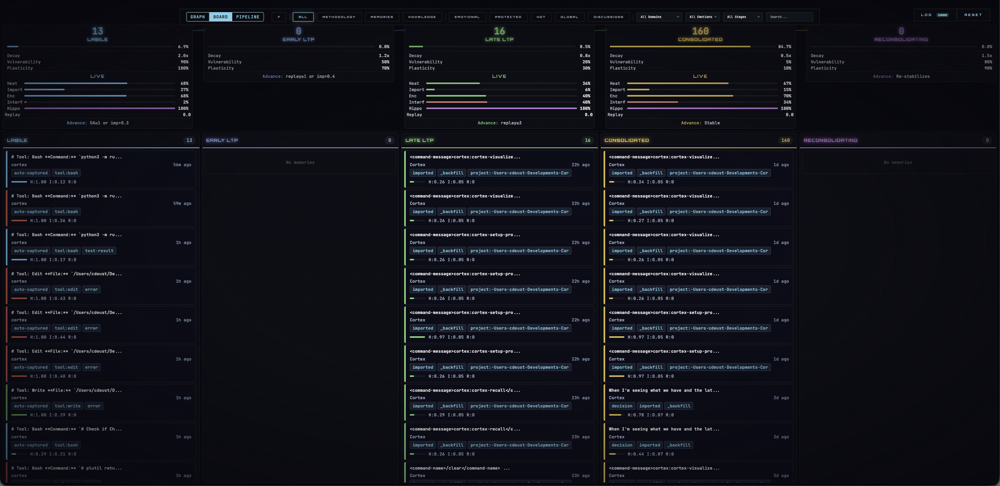
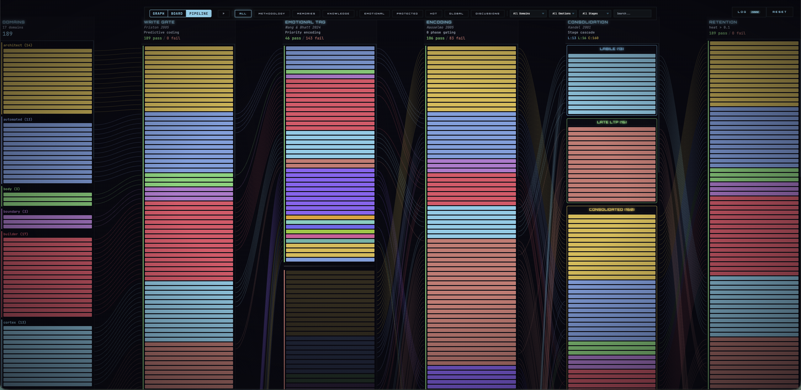
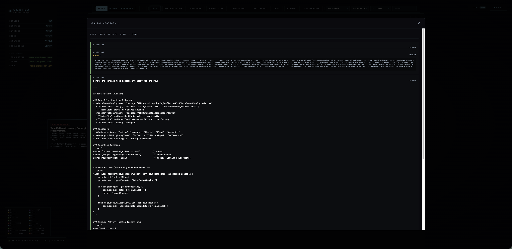

<div align="center">

# Cortex

### Persistent memory for Claude Code — built on neuroscience research, not guesswork

[](https://github.com/cdeust/Cortex/actions/workflows/ci.yml)
[](LICENSE)
[](https://python.org)
[](#development)

Memory that learns, consolidates, forgets intelligently, and surfaces the right context at the right time.

**97.8% R@10 LongMemEval** · **+21.5% BEAM-10M** · **41 paper citations** · **2080 tests**

[Getting Started](#getting-started) | [How It Works](#how-it-works) | [Neural Graph](#neural-graph) | [Agent Integration](#agent-integration) | [Benchmarks](#benchmarks) | [Scientific Foundation](#scientific-foundation)

**Companion projects:**
[cortex-beam-abstain](https://github.com/cdeust/cortex-know-when-to-stop-training-model) — community-trained retrieval abstention model for RAG systems
| [zetetic-team-subagents](https://github.com/cdeust/zetetic-team-subagents) — specialist Claude Code agents Cortex orchestrates with

</div>

---

## Getting Started

### Prerequisites

- **Python 3.10+**
- **PostgreSQL 15+** with [pgvector](https://github.com/pgvector/pgvector) and pg_trgm extensions
- **Claude Code** CLI or desktop app

### Option A — Claude Code Marketplace (recommended)

```bash
claude plugin marketplace add cdeust/Cortex
claude plugin install cortex
```

Restart your Claude Code session, then run:

```
/cortex-setup-project
```

This handles everything: PostgreSQL + pgvector installation, database creation, embedding model download, cognitive profile building from session history, codebase seeding, conversation import, and hook registration. Zero manual steps.

> **Using Claude Cowork?** Install [Cortex-cowork](https://github.com/cdeust/Cortex-cowork) instead — uses SQLite, no PostgreSQL required.
>
> ```bash
> claude plugin marketplace add cdeust/Cortex-cowork
> claude plugin install cortex-cowork
> ```

### Option B — Standalone MCP (no plugin)

```bash
claude mcp add cortex -- uvx --from "neuro-cortex-memory[postgresql]" neuro-cortex-memory
```

Adds Cortex as a standalone MCP server via [uvx](https://docs.astral.sh/uv/). No hooks, no skills — just the 33 MCP tools. Requires `uv` installed.

<details>
<summary><strong>More installation options</strong> (Clone, Docker, Manual)</summary>

### Option C — Clone + Setup Script

```bash
git clone https://github.com/cdeust/Cortex.git
cd Cortex
bash scripts/setup.sh        # macOS / Linux
python3 scripts/setup.py     # Windows / cross-platform
```

### Option D — Docker

```bash
git clone https://github.com/cdeust/Cortex.git && cd Cortex
docker build -t cortex-runtime -f docker/Dockerfile .
docker run -it \
  -v $(pwd):/workspace \
  -v cortex-pgdata:/var/lib/postgresql/17/data \
  -v ~/.claude:/home/cortex/.claude-host:ro \
  -v ~/.claude.json:/home/cortex/.claude-host-json/.claude.json:ro \
  cortex-runtime
```

### Option E — Manual Setup

<details>
<summary>Step-by-step instructions</summary>

**1. Install PostgreSQL + pgvector**

```bash
# macOS
brew install postgresql@17 pgvector
brew services start postgresql@17

# Ubuntu/Debian
sudo apt-get install postgresql postgresql-server-dev-all
sudo apt-get install postgresql-17-pgvector
sudo systemctl start postgresql
```

**2. Create the database**

```bash
createdb cortex
psql cortex -c "CREATE EXTENSION IF NOT EXISTS vector;"
psql cortex -c "CREATE EXTENSION IF NOT EXISTS pg_trgm;"
```

**3. Install Python dependencies**

```bash
pip install -e ".[postgresql]"
pip install sentence-transformers flashrank
```

**4. Initialize schema**

```bash
export DATABASE_URL=postgresql://localhost:5432/cortex
python3 -c "
from mcp_server.infrastructure.pg_schema import get_all_ddl
from mcp_server.infrastructure.pg_store import PgStore
import asyncio
asyncio.run(PgStore(database_url='$DATABASE_URL').initialize())
"
```

**5. Pre-cache the embedding model**

```bash
python3 -c "from sentence_transformers import SentenceTransformer; SentenceTransformer('all-MiniLM-L6-v2')"
```

**6. Register MCP server**

```bash
claude mcp add cortex -- uvx --from "neuro-cortex-memory[postgresql]" neuro-cortex-memory
```

Restart Claude Code to activate.

</details>
</details>

### Verify Installation

After setup, open Claude Code in any project. The SessionStart hook should inject context automatically. You can also test manually:

```bash
python3 -m mcp_server  # Should start on stdio without errors
```

### Configuration

Set `DATABASE_URL` (default: `postgresql://localhost:5432/cortex`). All parameters use the `CORTEX_MEMORY_` prefix — see `mcp_server/infrastructure/memory_config.py` for the full list (~40 parameters).

---

## How It Works

Cortex runs invisibly alongside Claude Code. You don't manage memory — it does.

### Your session, automatically enriched

| When | What happens | You see |
|---|---|---|
| **Session starts** | Cortex loads your hot memories, anchored decisions, and team context into Claude's prompt | Claude already knows what you were working on yesterday |
| **You write code** | Hooks capture edits, commands, and test results as memories. Related memories get a heat boost so they surface in future recalls | Nothing — it's automatic |
| **You ask a question** | Cortex searches 5 signals simultaneously (meaning, keywords, fuzzy match, importance, recency), reranks with a cross-encoder, and injects the best matches into Claude's context | Claude answers with context from weeks ago that you forgot about |
| **Session ends** | A "dream" cycle decays old memories, compresses verbose ones, and promotes repeated patterns into general knowledge | Your next session is cleaner and more focused |
| **Days pass** | Unused memories cool down naturally. Important ones stay hot. Protected decisions never decay | Cortex forgets the noise, keeps the signal |

### Retrieval: five signals, one answer

When you search, Cortex doesn't just look for similar text — it combines five different signals, all computed inside PostgreSQL in a single query:

<p align="center">

</p>

| Signal | What it finds | Example |
|---|---|---|
| **Vector similarity** | Memories with similar *meaning* | "fix the auth bug" finds "resolved authentication issue" |
| **Full-text search** | Memories with matching *keywords* | "PostgreSQL migration" finds exact term matches |
| **Trigram similarity** | Memories with similar *spelling* | "postgre" still finds "PostgreSQL" |
| **Thermodynamic heat** | Memories you use *frequently* | Your most-accessed architectural decisions rank higher |
| **Recency** | Memories from *recent* sessions | Yesterday's context ranks above last month's |

After fusion, a cross-encoder AI (FlashRank) re-scores the top candidates for a final quality check.

For conversations over 1M tokens, the **Structured Context Assembler** replaces flat search with stage-scoped 3-phase retrieval — see [benchmarks](#benchmarks) for measured results.

### Auto-generated project wiki

Every time you store a memory (manually or via hooks), Cortex doesn't just save it — it extracts entities, builds relationships, detects schemas, and links the new memory into a growing knowledge graph. Over time, this becomes a **living wiki of your project**: decisions and their rationale, patterns that emerged, lessons learned, architectural constraints, and how they all connect.

You can explore this wiki through:
- **`/cortex-visualize`** — interactive neural graph in your browser (see screenshots below)
- **`/cortex-explore-memory`** — navigate by entity, domain, or time
- **`get_causal_chain`** — trace how one decision led to another
- **`get_project_story`** — auto-generated narrative of your project's evolution
- **`detect_gaps`** — find areas where knowledge is thin or isolated

This isn't documentation you write — it's documentation that writes itself from how you work.

### Seven hooks — zero configuration

Hooks fire automatically via Claude Code's plugin system. No manual setup after installation.

| Hook | When it fires | What it does for you |
|---|---|---|
| **SessionStart** | You open Claude Code | Loads your hot memories, anchored decisions, and last checkpoint |
| **UserPromptSubmit** | Before Claude responds | Searches for memories relevant to what you just asked |
| **PostToolUse** | After you edit/write/run code | Captures the action as a memory if it's significant |
| **PostToolUse** | After you read/edit files | Boosts related memories so they surface in the next recall |
| **SessionEnd** | You close Claude Code | Runs the dream cycle — decay, compress, consolidate |
| **Compaction** | Claude's context window fills up | Saves a checkpoint so nothing is lost when context compresses |
| **SubagentStart** | An agent is spawned | Briefs the agent with your prior work and team decisions |

---

## Neural Graph

Launch the interactive visualization with `/cortex-visualize`. Three views: Graph, Board, and Pipeline.

### Graph View

Force-directed neural graph showing domain clusters, memories, entities, and discussions connected by typed edges.

<p align="center">

</p>

### Board View

Memories organized by biological consolidation stage. Each column shows decay rate, vulnerability, and plasticity. Memory cards display domain, heat, importance, and emotional tags.

<p align="center">

</p>

### Pipeline View

Horizontal flow from domains through the write gate into consolidation stages. Block height reflects importance, color indicates domain.

<p align="center">

</p>

### Detail Panels

Click any node for full context. Discussion nodes show session timeline, tools used, keywords, and a full conversation viewer. Memory nodes show biological meters (encoding strength, interference, schema match) and git diffs.

<p align="center">


</p>

### Filters

Domain, emotion, and consolidation stage dropdowns. Toggle buttons for methodology, memories, knowledge, emotional nodes, protected/hot/global memories, and discussions.

---

## Agent Integration

Cortex is designed to work with a team of specialized agents. Each agent has scoped memory (`agent_topic`) while sharing critical decisions across the team.

### Transactive Memory System

Based on Wegner 1987: teams store more knowledge than individuals because each member specializes, and a shared directory tells everyone who knows what.

<p align="center">

</p>

**Specialization** — each agent writes to its own topic. Engineer's debugging notes don't clutter tester's recall.

**Coordination** — decisions auto-protect and propagate. When engineer decides "use Redis over Memcached," every agent sees it at next session start.

**Directory** — entity-based queries span all topics. "What do we know about the reranker?" returns results from engineer, tester, and researcher.

### Agent Briefing

When the orchestrator spawns a specialist agent, the SubagentStart hook automatically:

1. Extracts task keywords from the prompt
2. Queries agent-scoped prior work (FTS, no embedding load needed)
3. Fetches team decisions (protected + global memories from other agents)
4. Injects as context prefix — agent starts with knowledge

### Compatible Agent Team

Works with any custom Claude Code agents. See [zetetic-team-subagents](https://github.com/cdeust/zetetic-team-subagents) for a ready-made team of **18 specialists** (engineer, architect, researcher, DBA, security auditor, and more) — each with scoped memory that doesn't clutter the others.

### Slash Commands

After plugin install, use these from any Claude Code session:

| Command | What it does |
|---|---|
| `/cortex-setup-project` | Bootstrap memory for a new project (one-time) |
| `/cortex-recall` | Search memories with intent-adaptive retrieval |
| `/cortex-consolidate` | Run maintenance — decay, compress, consolidate |
| `/cortex-visualize` | Launch the interactive neural graph in your browser |
| `/cortex-remember` | Manually store something important |
| `/cortex-explore-memory` | Navigate memory by entity, domain, or time |
| `/cortex-profile` | View your cognitive methodology profile |

---

## Scientific Foundation

Built on **41 published papers** across neuroscience, information retrieval, and cognitive science. **20 biological mechanisms** implemented faithfully — not as metaphors, but with the actual equations from the papers. Every threshold, weight, and algorithm traces to a published source or measured ablation. Nothing is guessed.

| What Cortex does | How your brain does it | Paper |
|---|---|---|
| Only stores what's genuinely new | Predictive coding — your brain filters out predictable input | Friston 2005 |
| Emotional memories are stronger | Amygdala tags important moments for priority encoding | Wang & Bhatt 2024 |
| Replays important memories during idle time | Hippocampal sharp-wave ripples during sleep | Foster & Wilson 2006 |
| Old memories compress to summaries | Episodic → semantic transfer over time | McClelland et al. 1995 |
| Unused memories fade, accessed ones stay hot | Power-law forgetting curve | Anderson & Lebiere 1998 |
| Similar memories stay distinct | Dentate gyrus pattern separation | Leutgeb et al. 2007 |
| Related memories form reusable templates | Schema formation in prefrontal cortex | Tse et al. 2007 |
| Important new info retroactively boosts old related memories | Synaptic tagging and capture | Frey & Morris 1997 |

**Technical deep-dives:** [docs/science.md](docs/science.md) — full paper citations, equations, ablation data, and per-module audit | [Research post on structured context assembly](docs/research-post-context-assembly.md) — the BEAM-10M +21.5% result with full methodology and provenance

---

## Benchmarks

All scores are **retrieval-only** — no LLM reader. We measure whether the right evidence appears in the top results.

| Benchmark | What it tests | Cortex | Paper best | Paper |
|---|---|---|---|---|
| **LongMemEval** | 500 questions across ~40 sessions | **97.8% R@10** | 78.4% | Wang et al., ICLR 2025 |
| **LoCoMo** | 1986 questions, multi-session conversations | **92.6% R@10** | — | Maharana et al., ACL 2024 |
| **BEAM-100K** | 20 conversations, 100K tokens each | **0.602 MRR** | 0.329 (LIGHT) | Tavakoli et al., ICLR 2026 |
| **BEAM-10M** | 10 conversations, 10M tokens each (hardest) | **0.429 MRR (+21.5%)** | 0.266 (LIGHT) | Tavakoli et al., ICLR 2026 |

The BEAM-10M improvement comes from the [Structured Context Assembly](docs/research-post-context-assembly.md) architecture — originating from [ai-prd-builder](https://github.com/cdeust/ai-prd-builder) (September 2025, one month before the BEAM paper).

<details>
<summary>Running benchmarks, measurement protocol, per-category breakdowns</summary>

```bash
pip install -e ".[postgresql,benchmarks,dev]"

python benchmarks/beam/run_benchmark.py --split 100K          # ~10 min
python benchmarks/beam/run_benchmark.py --split 10M           # ~50 min
CORTEX_USE_ASSEMBLER=1 python benchmarks/beam/run_benchmark.py --split 10M  # with assembler
python benchmarks/locomo/run_benchmark.py                     # ~40 min
python benchmarks/longmemeval/run_benchmark.py --variant s    # ~45 min
```

All BEAM scores measured on a fresh database (DROP + CREATE per run), TRUNCATE between conversations, FlashRank preflight verified, deterministic within ±0.01 MRR. Full ablation results, per-category breakdowns, and methodology in [docs/science.md](docs/science.md) and [docs/research-post-context-assembly.md](docs/research-post-context-assembly.md).

</details>

---

## Architecture

Clean Architecture — the brain (core logic) never touches the outside world. Everything flows through strict layers:

<p align="center">

</p>

| Layer | What lives here | Count |
|---|---|---|
| **core/** | Neuroscience + retrieval logic | 118 modules |
| **context_assembly/** | Structured context assembler | 10 modules |
| **infrastructure/** | PostgreSQL, embeddings, file I/O | 33 modules |
| **handlers/** | MCP tools | 62 tools |
| **hooks/** | Lifecycle automation | 7 hooks |

**Storage:** PostgreSQL 15+ with pgvector (HNSW) and pg_trgm. All retrieval in PL/pgSQL stored procedures.

---

## Security

Runs **100% locally** — MCP over stdio, PostgreSQL on localhost, visualization on 127.0.0.1. No data leaves your machine. Audit score: **91/100** (all SQL parameterized, Pydantic validation on all tools, HTML escaping on visualization, input length limits, path traversal protection).

---

## Development

```bash
pytest                    # 2080 tests
ruff check .              # Lint
ruff format --check .     # Format
```

---

## License

MIT

## Citation

```bibtex
@software{cortex2026,
  title={Cortex: Persistent Memory for Claude Code},
  author={Deust, Clement},
  year={2026},
  url={https://github.com/cdeust/Cortex}
}
```
</div>
