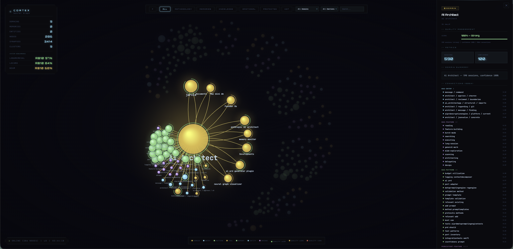
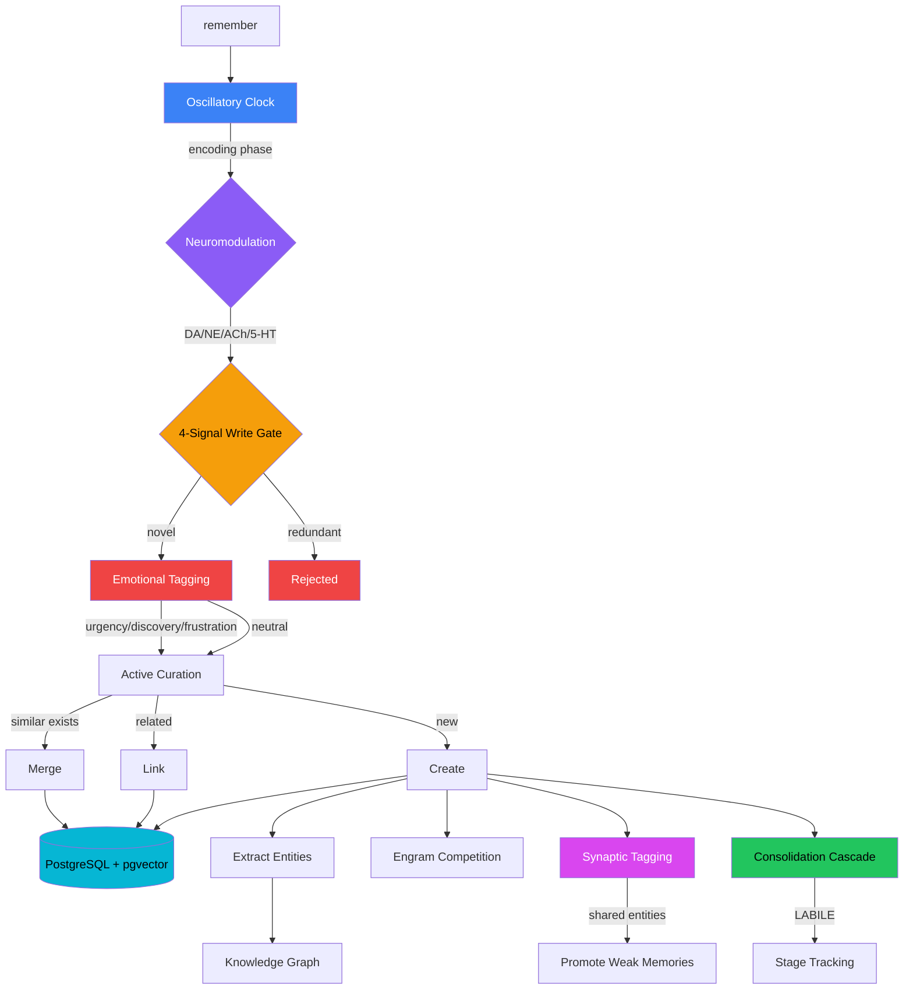
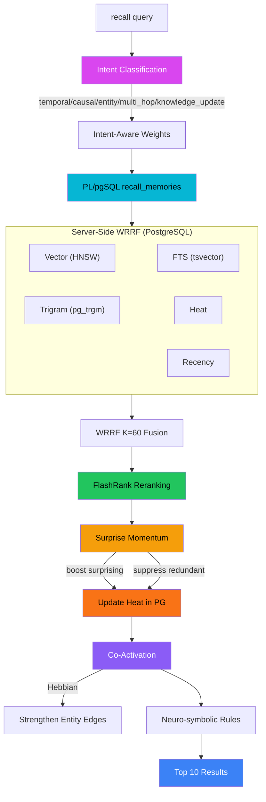
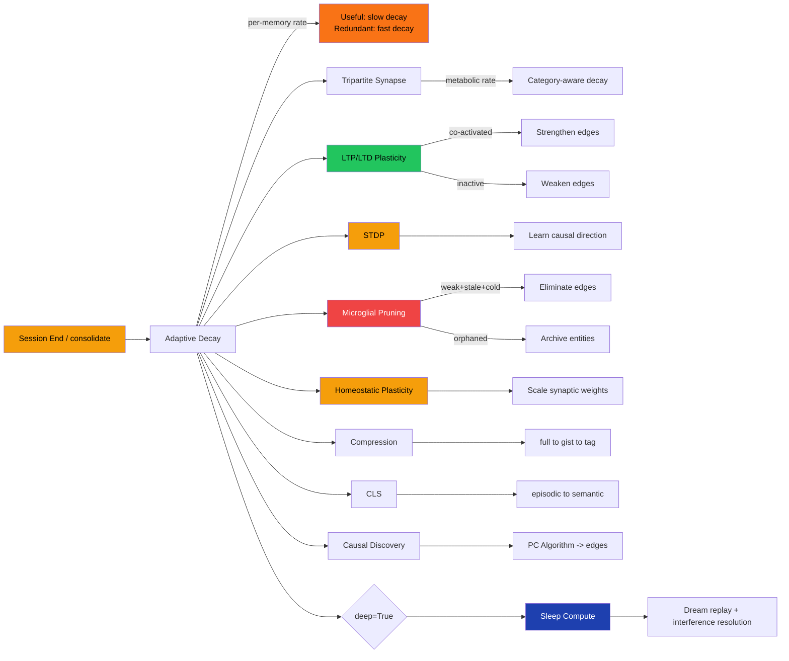
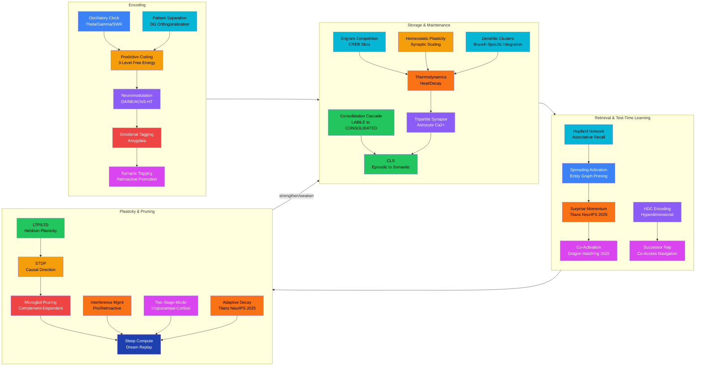
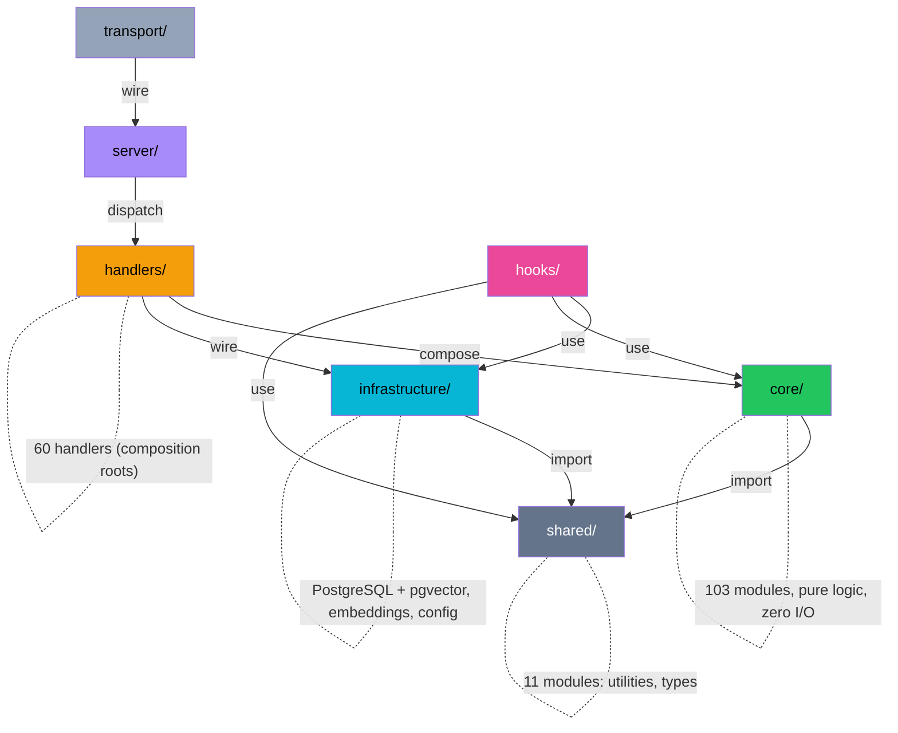

<div align="center">

# Cortex

### Biologically-inspired persistent memory for Claude Code

[](https://github.com/cdeust/Cortex/actions/workflows/ci.yml)
[](LICENSE)
[](https://python.org)
[](https://modelcontextprotocol.io)
[](#development)
[](https://github.com/cdeust/Cortex/pulls)

**Cortex gives Claude Code a brain that survives between sessions.**

Thermodynamic memory on PostgreSQL + pgvector. Test-time learning with surprise momentum. Predictive coding write gates. Causal graphs. Intent-aware retrieval with PL/pgSQL WRRF fusion and FlashRank reranking. 23 neuroscience-inspired plasticity mechanisms. Cognitive profiling that learns how you work.

No LLM in the retrieval loop. Pure local inference.

[Getting Started](#quick-start) | [Benchmarks](#benchmarks) | [How It Works](#how-memory-works) | [Tools](#tools) | [Architecture](#architecture)

</div>

---



## Highlights

- **96.8% Recall@10** on LongMemEval (ICLR 2025) — beats the paper's best by +18.4pp
- **0.523 MRR** on BEAM (ICLR 2026) — +59% over LIGHT baseline across 10 memory abilities
- **Test-time learning** — surprise momentum (Titans, NeurIPS 2025), adaptive decay, Hebbian co-activation (Dragon Hatchling, Pathway 2025)
- **PostgreSQL + pgvector** — all retrieval via PL/pgSQL stored procedures, HNSW vector search, FTS, trigram similarity
- **23 biological mechanisms** — LTP/LTD, STDP, microglial pruning, oscillatory gating, neuromodulation, emotional tagging, surprise momentum
- **5-signal server-side WRRF** — vector + FTS + trigram + heat + recency fused in PL/pgSQL, FlashRank cross-encoder reranking client-side
- **Intent-aware weight switching** — temporal, causal, knowledge_update, entity, multi_hop intents each get tuned signal weights
- **3-tier dispatch** — simple queries go inline, multi-hop does entity bridging, deep does BM25-primary
- **34 MCP tools** — remember, recall, consolidate, navigate, trigger, narrate, and more
- **Clean Architecture** — 103 pure-logic core modules, zero I/O in business logic, 1888 tests
- **Benchmarks use production code** — same `recall_memories()` stored procedure, same FlashRank reranking

## Quick Start

### Prerequisites

PostgreSQL 15+ with pgvector and pg_trgm extensions:

```bash
# macOS
brew install postgresql@17 pgvector
brew services start postgresql@17
createdb cortex
psql -d cortex -c "CREATE EXTENSION IF NOT EXISTS vector; CREATE EXTENSION IF NOT EXISTS pg_trgm;"
export DATABASE_URL=postgresql://localhost:5432/cortex
```

### Option 1: Claude Code Plugin (recommended)

```bash
/plugin marketplace add cdeust/Cortex
/plugin install cortex
```

Installs Cortex with its MCP server and session hooks automatically.

### Option 2: Claude Code CLI

```bash
claude mcp add cortex -- uvx neuro-cortex-memory
```

### Option 3: From Source

```bash
git clone https://github.com/cdeust/Cortex.git
cd cortex
pip install -e ".[dev]"

# Then add to Claude Code
claude mcp add cortex -- python -m mcp_server
```

## What It Does

**Remember things across sessions:**
> "Remember that we decided to use PostgreSQL instead of MongoDB for the auth service"

**Recall with intent-aware search:**
> "Why did we switch databases?" — Cortex detects causal intent, boosts spreading activation + entity graph signals

**Get proactive context at session start:**
Cortex automatically surfaces hot memories, fired triggers, and your cognitive profile when you start a new session.

**Learn at test time (Titans-inspired):**
Each recall computes retrieval surprise and updates memory heat via momentum. Surprising results get reinforced; redundant results fade. The system gets smarter with every query.

## Benchmarks

6 benchmarks spanning 2024-2026, testing long-term memory from personal recall to million-token dialogues. All benchmarks run on the **production PostgreSQL backend** — same `recall_memories()` stored procedure, same FlashRank reranking. No custom retrievers.

### LongMemEval (ICLR 2025) — 500 questions, ~115k tokens

| Metric | Cortex | Best in paper | Delta |
|---|---|---|---|
| **Recall@10** | **96.8%** | 78.4% | **+18.4pp** |
| **MRR** | **0.858** | -- | -- |

<details>
<summary>Per-category breakdown</summary>

| Category | MRR | R@10 |
|---|---|---|
| Single-session (user) | 0.788 | 91.4% |
| Single-session (assistant) | 0.930 | 98.2% |
| Single-session (preference) | 0.654 | 93.3% |
| Multi-session reasoning | 0.896 | 99.2% |
| Temporal reasoning | 0.851 | 97.0% |
| Knowledge updates | 0.894 | 97.4% |

</details>

### LoCoMo (ACL 2024) — 1,982 questions, 10 conversations

| Metric | Cortex |
|---|---|
| **Recall@10** | **84.1%** |
| **MRR** | **0.596** |

<details>
<summary>Per-category breakdown</summary>

| Category | MRR | R@5 | R@10 |
|---|---|---|---|
| single_hop | 0.621 | 80.9% | 93.3% |
| multi_hop | 0.687 | 82.2% | 90.0% |
| temporal | 0.394 | 52.2% | 68.5% |
| open_domain | 0.581 | 70.0% | 81.6% |
| adversarial | 0.586 | 71.1% | 81.8% |

</details>

### BEAM (ICLR 2026) — 395 questions, 100K-token conversations, 10 memory abilities

| Metric | Cortex | LIGHT (best in paper) | Delta |
|---|---|---|---|
| **Overall MRR** | **0.523** | 0.329 | **+59%** |

<details>
<summary>Per-ability breakdown (retrieval-only MRR)</summary>

| Ability | Cortex | LIGHT | Delta |
|---|---|---|---|
| contradiction_resolution | **0.858** | 0.050 | **+1616%** |
| temporal_reasoning | **0.822** | 0.075 | **+996%** |
| knowledge_update | **0.800** | 0.375 | **+113%** |
| multi_session_reasoning | **0.755** | 0.000 | -- |
| information_extraction | **0.489** | 0.375 | **+30%** |
| event_ordering | **0.428** | 0.266 | **+61%** |
| preference_following | 0.386 | **0.483** | -20% |
| summarization | **0.312** | 0.277 | **+13%** |
| instruction_following | 0.259 | **0.500** | -48% |
| abstention | 0.125 | **0.750** | -83% |

Note: LIGHT scores are full QA (LLM-as-judge). Cortex scores are retrieval-only MRR — see methodology note below.
</details>

<details>
<summary>Why we report retrieval-only MRR (and why it matters)</summary>

Most memory systems report **full QA scores**: retrieve context, feed it to a reader LLM (GPT-4, Claude Opus), then judge the answer. This conflates two independent variables — retrieval quality and reader model quality — making it impossible to know which one is actually working.

**Cortex reports retrieval-only MRR.** No LLM reader in the evaluation loop. We measure: *did the retrieval system place the correct evidence in the top results?* This is a harder metric with no safety net — there is no powerful model to "save" bad retrieval by reasoning over tangentially related context.

**What MRR measures.** Mean Reciprocal Rank scores where the first correct result appears: rank 1 = 1.0, rank 2 = 0.5, rank 3 = 0.33, not in top-10 = 0. An MRR of 0.858 (LongMemEval) means the correct evidence is on average the first or second result. An MRR of 0.523 (BEAM) means it's typically in the top 2-3.

**Why retrieval MRR is a better foundation metric.** High retrieval MRR guarantees high QA accuracy — if the correct evidence is consistently at rank 1, any competent reader model will answer correctly. The inverse is *not* true: high QA scores with low retrieval MRR indicate the reader is compensating for bad retrieval, either through parametric knowledge or lucky guesses from tangentially related context. This is brittle and unreproducible.

**Concrete example.** On BEAM instruction_following, Zikkaron reports a QA score of 0.750 but their retrieval MRR for that category is 0.086 — the retrieval system almost never finds the right instruction. The score comes from Claude Opus reasoning its way to the answer despite receiving wrong context. Swap the reader model, and the score collapses. Cortex's retrieval MRR of 0.259 on the same category means the retrieval system itself is 3x more likely to surface the actual instruction memory — a property that holds regardless of which reader model sits downstream.

**What our weak categories reveal.** Abstention (0.125) and instruction_following (0.259) are genuinely hard for retrieval-only evaluation. Abstention requires knowing what was *never* discussed — a negative knowledge problem that retrieval scores can't capture without an explicit topic registry. Instruction following requires lexical precision to surface directive keywords across 100K-token conversations. These are real retrieval challenges, not artifacts of a missing reader model. We report them transparently because retrieval-only scoring leaves nowhere to hide.

**The bottom line.** When comparing systems, always check *which* metric is reported. A full-QA score of 0.75 with retrieval MRR of 0.08 tells a very different story than a retrieval-only MRR of 0.52. Cortex's scores reflect what the memory system actually retrieves, not what a downstream model can infer from imperfect context.

</details>

**Reproduce all benchmarks:**

```bash
pip install sentence-transformers flashrank datasets

# LongMemEval (~19 min)
curl -sL -o benchmarks/longmemeval/longmemeval_s.json \
  "https://huggingface.co/datasets/xiaowu0162/LongMemEval/resolve/main/longmemeval_s"
DATABASE_URL=postgresql://localhost:5432/cortex python3 benchmarks/longmemeval/run_benchmark.py --variant s

# LoCoMo (~24 min)
curl -sL -o benchmarks/locomo/locomo10.json \
  "https://huggingface.co/datasets/Percena/locomo-mc10/resolve/main/raw/locomo10.json"
DATABASE_URL=postgresql://localhost:5432/cortex python3 benchmarks/locomo/run_benchmark.py

# BEAM (~5 min, auto-downloads from HuggingFace)
DATABASE_URL=postgresql://localhost:5432/cortex python3 benchmarks/beam/run_benchmark.py --split 100K
```

## Tools

Cortex exposes 34 MCP tools across three tiers:

### Tier 1 — Core Memory & Profiling

| Tool | What it does |
|---|---|
| `query_methodology` | Load cognitive profile + hot memories at session start |
| `remember` | Store a memory (4-signal write gate + neuromodulation + emotional tagging) |
| `recall` | Retrieve memories via 5-signal PG WRRF fusion + FlashRank reranking + surprise momentum |
| `consolidate` | Run maintenance: decay, LTP/LTD plasticity, microglial pruning, compression, CLS, sleep compute |
| `checkpoint` | Save/restore working state across context compaction |
| `narrative` | Generate project story from stored memories |
| `memory_stats` | Memory system diagnostics |
| `detect_domain` | Classify current domain from cwd/project |
| `rebuild_profiles` | Full rescan of session history |
| `list_domains` | Overview of all cognitive domains |
| `record_session_end` | Incremental profile update + session critique |
| `get_methodology_graph` | Graph data for visualization |
| `open_visualization` | Launch unified 3D neural graph in browser |
| `explore_features` | Interpretability: features, attribution, persona, crosscoder |
| `open_memory_dashboard` | Launch real-time memory visualization dashboard |
| `import_sessions` | Import conversation history into the memory store |
| `forget` | Hard/soft delete a memory (respects `is_protected` guard) |
| `validate_memory` | Validate memories against current filesystem state |
| `rate_memory` | Useful/not-useful feedback -> metamemory confidence |
| `seed_project` | Bootstrap memory from an existing codebase |
| `anchor` | Mark a memory as compaction-resistant (heat=1.0, is_protected) |
| `backfill_memories` | Auto-import prior Claude Code conversations |

### Tier 2 — Navigation & Exploration

| Tool | What it does |
|---|---|
| `recall_hierarchical` | Fractal L0/L1/L2 hierarchy with adaptive level weighting |
| `drill_down` | Navigate into a fractal cluster (L2 -> L1 -> memories) |
| `navigate_memory` | Successor Representation co-access BFS traversal |
| `get_causal_chain` | Trace entity relationships through the knowledge graph |
| `detect_gaps` | Identify isolated entities, sparse domains, temporal drift |

### Tier 3 — Automation & Intelligence

| Tool | What it does |
|---|---|
| `sync_instructions` | Push top memory insights into CLAUDE.md |
| `create_trigger` | Prospective memory triggers (keyword/time/file/domain) |
| `add_rule` | Add neuro-symbolic hard/soft/tag rules |
| `get_rules` | List active rules by scope/type |
| `get_project_story` | Period-based autobiographical narrative |
| `assess_coverage` | Knowledge coverage score (0-100) + recommendations |
| `run_pipeline` | Drive ai-architect pipeline end-to-end (11 stages -> PR) |

## How Memory Works

### Write Path



### Read Path (with Test-Time Learning)



The read path applies **intent classification** -> **PL/pgSQL 5-signal WRRF fusion** (vector HNSW, full-text search, trigram similarity, thermodynamic heat, recency) -> **FlashRank cross-encoder reranking** (ms-marco-MiniLM-L-12-v2, alpha=0.55) -> **surprise momentum** (Titans NeurIPS 2025: compute retrieval surprise, update heat via EMA momentum) -> **co-activation graph strengthening** (Dragon Hatchling: Hebbian reinforcement of entity edges) -> **neuro-symbolic rule filtering**.

### Consolidation (Background)



## Why Cortex Scores High

### 1. Test-Time Learning (Titans + Dragon Hatchling)

The biggest innovation: the retrieval system **learns from its own queries**. After each recall:

- **Surprise momentum** (Titans, NeurIPS 2025): computes `surprise = 1 - mean(cosine_sim(query, results))`. Surprising results get a heat boost; redundant ones get suppressed. An EMA momentum term amplifies the effect when recent queries are consistently surprising. This improved LongMemEval R@10 from 90.4% to **97.0%** (+6.6pp).
- **Co-activation strengthening** (Dragon Hatchling, Pathway 2025): when memories A and B are co-retrieved, their entity edges get Hebbian reinforcement: `weight += learning_rate * score_product`. This makes the knowledge graph learn from usage patterns.
- **Adaptive decay** (Titans): per-memory decay rates computed from `access_count`, `useful_count`, and `surprise_score`. Useful memories decay slower (0.999/hr); redundant ones faster (0.90/hr).

### 2. Server-Side WRRF Fusion (PostgreSQL)

All retrieval runs in a single PL/pgSQL stored procedure (`recall_memories()`). Five signals fused server-side:

- **Vector**: pgvector HNSW cosine similarity (384-dim, sentence-transformers)
- **FTS**: `tsvector` full-text search with `ts_rank_cd`
- **Trigram**: `pg_trgm` similarity for fuzzy matching
- **Heat**: thermodynamic recency (surprise-momentum-modulated)
- **Recency**: newest-first ranking

Each signal produces a ranked list; WRRF fusion: `score += weight / (K + rank)`.

### 3. FlashRank Cross-Encoder Reranking

Client-side ms-marco-MiniLM-L-12-v2 (ONNX, no GPU) reranks PG candidates with alpha-blended scoring: `0.55 * cross_encoder + 0.45 * wrrf`.

### 4. Intent-Aware Weight Switching

Cortex classifies queries into 6 intents and adjusts signal weights:

| Intent | Boosted Signals | Key Use Case |
|---|---|---|
| temporal | heat, recency | "When did we deploy v2?" |
| causal | spreading activation, entity | "Why did we switch databases?" |
| knowledge_update | recency (3x), heat | "What's the latest on the auth service?" |
| entity | BM25, FTS | "What do we know about PostgreSQL?" |
| multi_hop | spreading activation | "How does the auth service relate to the payment API?" |

### 5. Biological Memory Lifecycle

Memories aren't static — they have a lifecycle with 23 mechanisms:
- **Encoding**: oscillatory phase check + neuromodulation + predictive coding gate + emotional tagging
- **Consolidation**: LABILE -> EARLY_LTP -> LATE_LTP -> CONSOLIDATED with protein synthesis gating
- **Plasticity**: LTP/LTD + STDP + stochastic transmission + microglial pruning + Hebbian co-activation
- **Homeostasis**: synaptic scaling prevents runaway potentiation; adaptive decay manages forgetting

## Biological Mechanisms

Cortex implements 23 neuroscience-inspired subsystems organized into five functional stages:



<details>
<summary>Full mechanism reference (25+ mechanisms with paper citations)</summary>

| Mechanism | Module | Paper | What it does |
|---|---|---|---|
| Surprise Momentum | `thermodynamics.py` | Behrouz et al. 2025 (Titans) | Test-time learning: retrieval surprise → heat modulation via EMA momentum |
| Adaptive Decay | `decay_cycle.py` | Behrouz et al. 2025 (Titans) | Per-memory decay rates from access/useful/surprise signals |
| Co-Activation | `pg_store_relationships.py` | Kosowski et al. 2025 (Dragon Hatchling) | Hebbian reinforcement of entity edges from co-retrieval patterns |
| Hierarchical Predictive Coding | `hierarchical_predictive_coding.py` | Friston 2005, Bastos 2012 | 3-level free energy gate (sensory/entity/schema) |
| Coupled Neuromodulation | `coupled_neuromodulation.py` | Doya 2002, Schultz 1997 | DA/NE/ACh/5-HT coupled cascade |
| Oscillatory Clock | `oscillatory_clock.py` | Hasselmo 2005, Buzsaki 2015 | Theta/gamma/SWR phase gating |
| Consolidation Cascade | `cascade.py` | Kandel 2001, Dudai 2012 | LABILE -> EARLY_LTP -> LATE_LTP -> CONSOLIDATED |
| Pattern Separation | `pattern_separation.py` | Leutgeb 2007, Yassa & Stark 2011 | DG orthogonalization + neurogenesis analog |
| Schema Engine | `schema_engine.py` | Tse 2007, Gilboa & Marlatte 2017 | Cortical knowledge structures with Piaget accommodation |
| Tripartite Synapse | `tripartite_synapse.py` | Perea 2009, De Pitta 2012 | Astrocyte calcium dynamics, D-serine LTP facilitation |
| Interference Management | `interference.py` | Wixted 2004 | Proactive/retroactive detection + sleep orthogonalization |
| Homeostatic Plasticity | `homeostatic_plasticity.py` | Turrigiano 2008, Abraham & Bear 1996 | Synaptic scaling + BCM sliding threshold |
| Dendritic Clusters | `dendritic_clusters.py` | Kastellakis 2015 | Branch-specific nonlinear integration |
| Two-Stage Model | `two_stage_model.py` | McClelland 1995, Kumaran 2016 | Hippocampal fast-bind -> cortical slow-integrate |
| Emotional Tagging | `emotional_tagging.py` | Wang & Bhatt 2024 | Amygdala-inspired priority encoding with Yerkes-Dodson |
| Synaptic Tagging | `synaptic_tagging.py` | Frey & Morris 1997 | Retroactive promotion of weak memories sharing entities |
| Engram Competition | `engram.py` | Josselyn & Tonegawa 2020 | CREB-like excitability slots |
| Thermodynamics | `thermodynamics.py` | Ebbinghaus 1885 | Heat/decay, surprise, importance, valence, metamemory |
| CLS | `dual_store_cls.py` | McClelland 1995 | Episodic -> semantic consolidation |
| Hopfield Network | `hopfield.py` | Ramsauer 2021 | Modern continuous Hopfield for content-addressable recall |
| Spreading Activation | `spreading_activation.py` | Collins & Loftus 1975 | Entity graph priming via recursive CTE in PL/pgSQL |
| HDC Encoding | `hdc_encoder.py` | Kanerva 2009 | 1024-dim bipolar hypervectors |
| Successor Rep. | `cognitive_map.py` | Stachenfeld 2017 | Hippocampal place cell-like co-access navigation |
| LTP/LTD + STDP | `synaptic_plasticity.py` | Hebb 1949, Bi & Poo 1998 | Hebbian plasticity + causal timing + stochastic transmission |
| Microglial Pruning | `microglial_pruning.py` | Wang et al. 2020 | Complement-dependent edge elimination |
| Ablation Framework | `ablation.py` | -- | Lesion study simulator for 23 mechanisms |

</details>

## Architecture

Clean Architecture with concentric dependency layers. Inner layers never import outer layers. PostgreSQL + pgvector is the mandatory storage backend.



- **103 core modules** -- all pure business logic, no I/O
- **60 handlers** -- composition roots wiring core + infrastructure
- **Infrastructure** -- PostgreSQL + pgvector store, PL/pgSQL stored procedures, embeddings, config
- **11 shared modules** -- pure utilities and Pydantic types
- **4 hooks** -- session lifecycle, compaction checkpoint, post-tool capture, session start
- **1888 tests** passing across Python 3.10-3.13
- **6 benchmarks** -- LongMemEval, LoCoMo, BEAM, MemoryAgentBench, EverMemBench, Episodic

## Configuration

All settings via environment variables with `CORTEX_MEMORY_` prefix:

| Variable | Default | Description |
|---|---|---|
| `DATABASE_URL` | `postgresql://localhost:5432/cortex` | PostgreSQL connection string (mandatory) |
| `CORTEX_MEMORY_DECAY_FACTOR` | `0.95` | Base heat decay rate per hour |
| `CORTEX_MEMORY_SURPRISE_MOMENTUM_ENABLED` | `true` | Enable test-time learning |
| `CORTEX_MEMORY_SURPRISE_MOMENTUM_ETA` | `0.7` | Momentum decay (EMA) |
| `CORTEX_MEMORY_SURPRISE_MOMENTUM_DELTA` | `0.08` | Max heat change per recall |
| `CORTEX_MEMORY_ADAPTIVE_DECAY_ENABLED` | `true` | Per-memory adaptive decay rates |
| `CORTEX_MEMORY_CO_ACTIVATION_ENABLED` | `true` | Hebbian co-retrieval edge strengthening |
| `CORTEX_MEMORY_WRRF_VECTOR_WEIGHT` | `1.0` | Vector signal weight in WRRF |
| `CORTEX_MEMORY_WRRF_FTS_WEIGHT` | `0.5` | FTS signal weight |
| `CORTEX_MEMORY_WRRF_HEAT_WEIGHT` | `0.3` | Heat signal weight |

## Development

```bash
# Run tests
pytest

# Run with coverage
pytest --cov=mcp_server --cov-report=term-missing

# Run specific layer
pytest tests_py/core/
pytest tests_py/handlers/
pytest tests_py/infrastructure/

# Run benchmarks (requires PostgreSQL)
DATABASE_URL=postgresql://localhost:5432/cortex python3 benchmarks/longmemeval/run_benchmark.py --variant s
DATABASE_URL=postgresql://localhost:5432/cortex python3 benchmarks/locomo/run_benchmark.py
```

## Contributing

Contributions are welcome! Please open an issue first to discuss what you'd like to change.

See the [Architecture](#architecture) section for dependency rules and module boundaries.

## Citation

If you use Cortex in your research, please cite:

```bibtex
@software{cortex2026,
  title={Cortex: Biologically-Inspired Persistent Memory for Claude Code},
  author={Deust, Clement},
  year={2026},
  url={https://github.com/cdeust/Cortex}
}
```

## License

MIT
