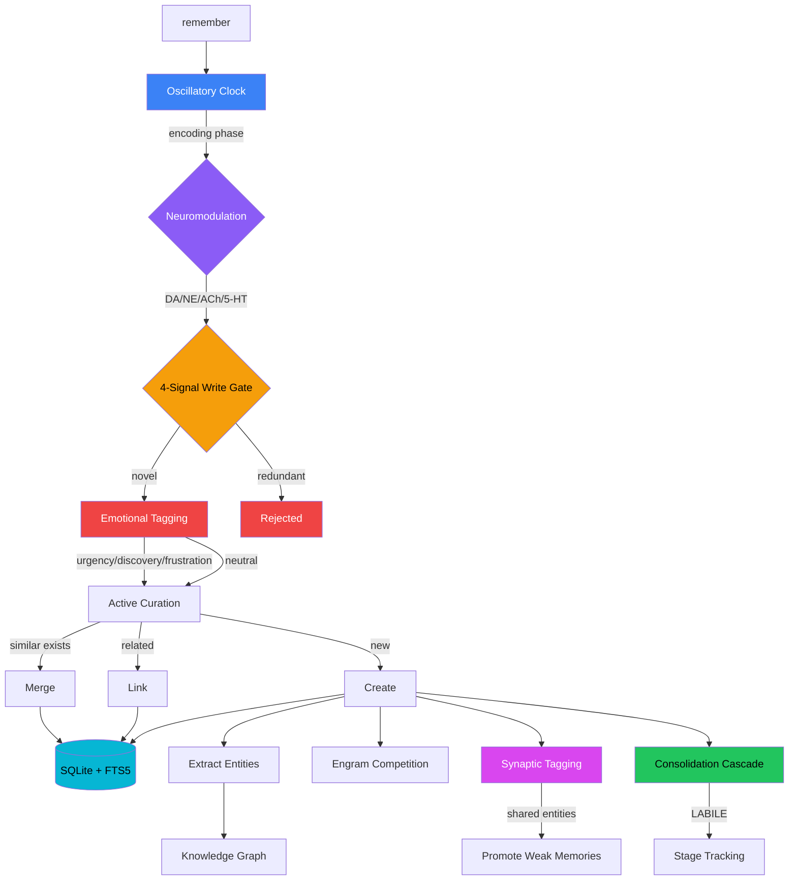
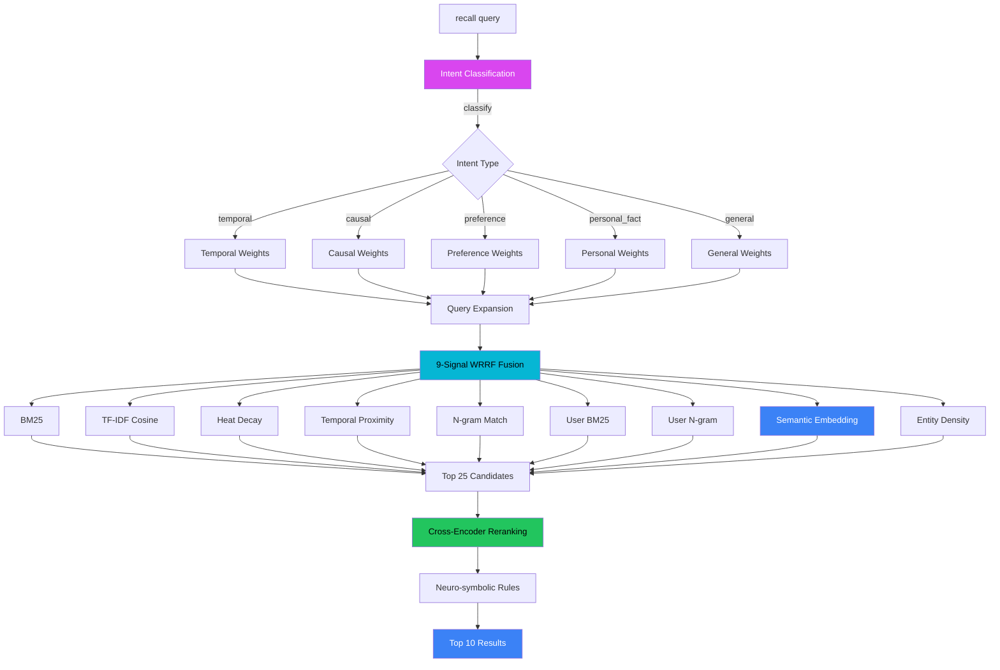
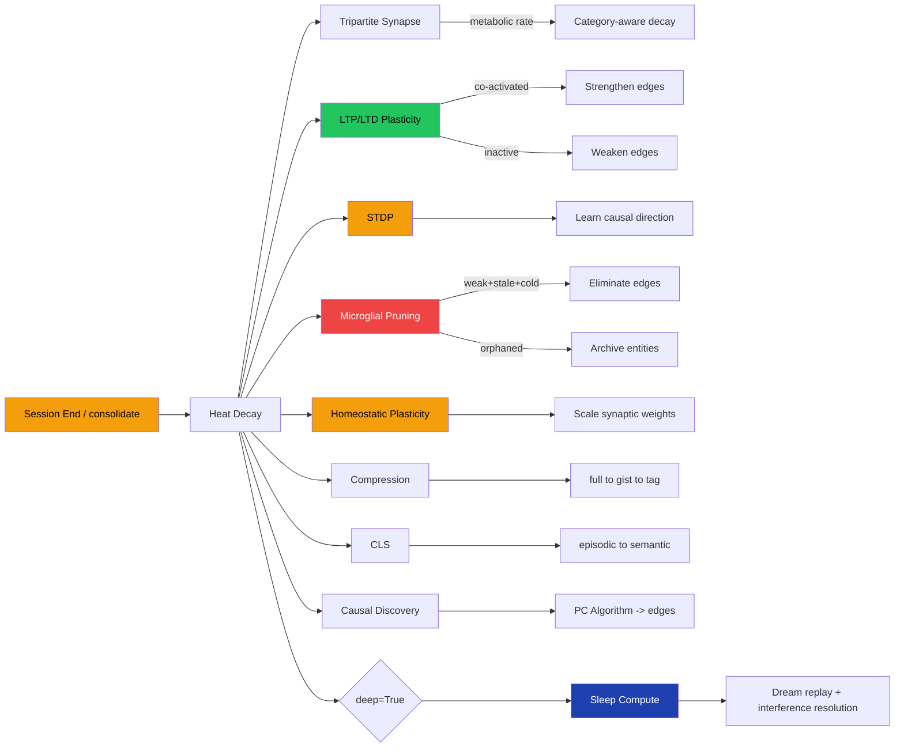
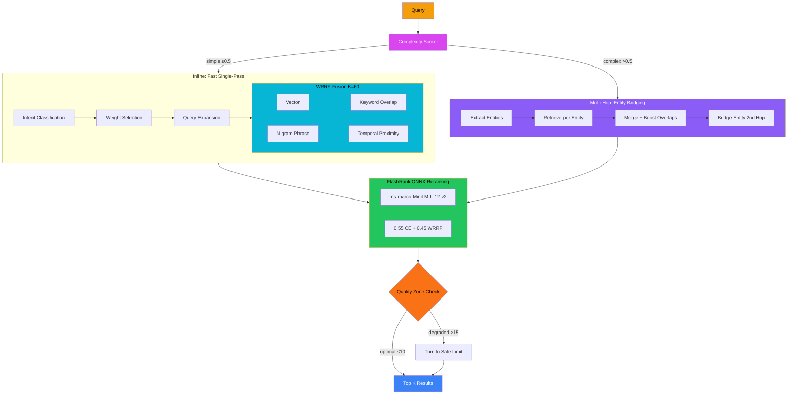
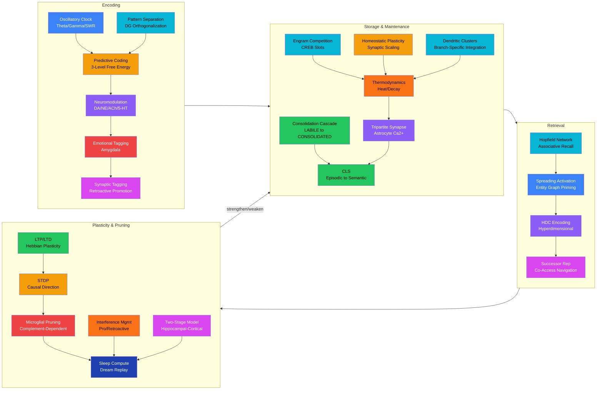

<div align="center">

# Cortex

### Biologically-inspired persistent memory for Claude Code

[](https://github.com/cdeust/Cortex/actions/workflows/ci.yml)
[](LICENSE)
[](https://python.org)
[](https://modelcontextprotocol.io)
[](#development)
[](https://github.com/cdeust/Cortex/pulls)

**Cortex gives Claude Code a brain that survives between sessions.**

Thermodynamic memory with heat/decay. Predictive coding write gates. Causal graphs. Intent-aware 9-signal retrieval with cross-encoder reranking. 20+ neuroscience-inspired plasticity mechanisms. Cognitive profiling that learns how you work.

No LLM in the retrieval loop. Pure local inference. 3 dependencies.

[Getting Started](#quick-start) | [Benchmarks](#benchmarks) | [How It Works](#how-memory-works) | [Tools](#tools) | [Architecture](#architecture)

</div>

---


## Highlights

- **98.6% Recall@10** on LongMemEval (ICLR 2025) — beats the paper's best by +20.2pp
- **20+ biological mechanisms** — LTP/LTD, STDP, microglial pruning, oscillatory gating, neuromodulation, emotional tagging
- **9-signal retrieval fusion** — BM25 + embeddings + heat + temporal + n-gram + entity density + spreading activation
- **FlashRank cross-encoder reranking** — ONNX, no GPU, 823ms/query
- **Intent-aware weight switching** — temporal, causal, preference, personal fact intents each get tuned signal weights
- **Smart dispatch** — complexity scoring routes simple queries inline, complex multi-entity queries to multi-hop bridging
- **34 MCP tools** — remember, recall, consolidate, navigate, trigger, narrate, and more
- **Clean Architecture** — 103 pure-logic core modules, zero I/O in business logic, 1893 tests
- **3 dependencies** — `fastmcp`, `pydantic`, `numpy`. That's it.

## Quick Start

### Option 1: Claude Code Plugin (recommended)

```bash
/plugin marketplace add cdeust/Cortex
/plugin install cortex
```

Installs Cortex with its MCP server and session hooks automatically.

### Option 2: Claude Code CLI

```bash
claude mcp add cortex -- uvx neuro-cortex-memory
```

### Option 3: Project `.mcp.json`

```json
{
  "mcpServers": {
    "cortex": {
      "command": "uvx",
      "args": ["cortex-memory"]
    }
  }
}
```

Commit this file — your whole team gets Cortex automatically.

### Option 4: From Source

```bash
git clone https://github.com/cdeust/Cortex.git
cd cortex
pip install -e ".[dev]"

# Then add to Claude Code
claude mcp add cortex -- python -m mcp_server
```

## What It Does

**Remember things across sessions:**
> "Remember that we decided to use PostgreSQL instead of MongoDB for the auth service"

**Recall with intent-aware search:**
> "Why did we switch databases?" — Cortex detects causal intent, boosts causal graph + spreading activation signals

**Get proactive context at session start:**
Cortex automatically surfaces hot memories, fired triggers, and your cognitive profile when you start a new session.

**Auto-consolidate with biological plasticity:**
Memories cool over time. Decisions decay slowly (1.5x lifespan). Error details decay fast (0.7x). Emotional memories resist decay. Knowledge graph edges strengthen via LTP when co-activated, weaken via LTD when unused, and get pruned by microglial elimination when stale.

## Benchmarks

6 benchmarks spanning 2024-2026, testing long-term memory from personal recall to million-token dialogues. No LLM in the retrieval loop — pure local inference.

### LongMemEval (ICLR 2025) — 500 questions, ~115k tokens

| Metric | Cortex | Best in paper | Delta |
|---|---|---|---|
| **Recall@10** | **98.6%** | 78.4% | **+20.2pp** |
| **MRR** | **0.865** | -- | -- |

The right memory is almost always in the candidate pool — **+20.2pp** above the paper's best R@10.

<details>
<summary>Per-category breakdown</summary>

| Category | MRR | R@10 |
|---|---|---|
| Single-session (user) | 0.851 | 97.1% |
| Single-session (assistant) | 0.979 | 100.0% |
| Single-session (preference) | 0.768 | 96.7% |
| Multi-session reasoning | 0.879 | 100.0% |
| Temporal reasoning | 0.797 | 97.7% |
| Knowledge updates | 0.923 | 98.7% |

</details>

### LoCoMo (ACL 2024) — 1,986 questions, 10 conversations

| Metric | Cortex |
|---|---|
| **Recall@10** | **94.8%** |
| **MRR** | **0.710** |

94.8% R@10 — the right session is in the top 10 for nearly all questions across 1,986 QA pairs.

<details>
<summary>Per-category breakdown</summary>

| Category | MRR | R@10 |
|---|---|---|
| single_hop | 0.638 | 96.1% |
| multi_hop | 0.734 | 96.3% |
| temporal | 0.475 | 83.7% |
| open_domain | 0.721 | 93.7% |
| adversarial | 0.766 | 97.1% |

</details>

### BEAM (ICLR 2026) — 355 questions, 100K-token conversations, 10 memory abilities

| Metric | Cortex | LIGHT (best in paper) |
|---|---|---|
| **Overall** | **0.353** | 0.329 |

<details>
<summary>Per-ability breakdown (retrieval-only MRR)</summary>

| Ability | Cortex | LIGHT |
|---|---|---|
| multi_session_reasoning | **0.765** | 0.000 |
| information_extraction | **0.639** | 0.375 |
| preference_following | **0.491** | 0.483 |
| event_ordering | **0.389** | 0.266 |
| summarization | **0.329** | 0.277 |
| knowledge_update | 0.308 | 0.375 |
| instruction_following | 0.257 | 0.500 |
| temporal_reasoning | 0.000 | 0.075 |
| contradiction_resolution | 0.000 | 0.050 |

Note: LIGHT scores are full QA (LLM-as-judge). Cortex scores are retrieval-only.
</details>

### MemoryAgentBench (ICLR 2026) — 146 rows, 4 memory competencies

Evaluates retrieval, test-time learning, long-range understanding, and conflict resolution (Hu et al., ICLR 2026).

| Metric | Cortex | Description |
|---|---|---|
| **Substring EM** | **0.560** | Answer found in retrieved context |
| **F1** | 0.001 | Token-level F1 (low because retrieval returns full chunks, not extracted answers) |

Substring EM of 56% means the correct answer text appears in the top-5 retrieved chunks for over half of questions — without any LLM reader.

### EverMemBench (2026) — 2,400 QA, multi-party collaborative dialogues, 1M+ tokens

Tests memory across 5 projects, 170 employees, 365 simulated days (Hu et al., 2026).

| Dimension | Cortex | Best Published (MemOS) |
|---|---|---|
| **Memory Awareness** | **100.0%** | 42.6% |
| **Profile Understanding** | **100.0%** | -- |
| Fine-grained Recall | 10.9% | -- |
| **Overall** | **71.5%** | 42.6% |

<details>
<summary>Per-category breakdown</summary>

| Category | Accuracy | Questions |
|---|---|---|
| memory_awareness/constraint | 100.0% | 86 |
| memory_awareness/proactivity | 100.0% | 84 |
| memory_awareness/update | 100.0% | 54 |
| profile_understanding/title | 100.0% | 39 |
| profile_understanding/skill | 100.0% | 35 |
| profile_understanding/style | 100.0% | 37 |
| fine_grained_recall/single_hop | 32.6% | 43 |
| fine_grained_recall/multi_hop | 0.0% | 50 |
| fine_grained_recall/temporal | 0.0% | 60 |

</details>

### Episodic Memories Benchmark (ICLR 2025) — spatio-temporal episodic recall

Tests recall of events (date, location, entity, content) from synthetic narratives (Huet et al., ICLR 2025).

| Metric | Cortex | Gemini 2.5 Pro | Claude 3.5 Sonnet |
|---|---|---|---|
| **Simple Recall Score** | **0.875** | 0.968 | ~0.85 |

<details>
<summary>Per-bin breakdown</summary>

| Bin (events to recall) | Mean F1 |
|---|---|
| bin_0 (hallucination test) | 0.500 |
| bin_1 (single event) | 1.000 |
| bin_2 (two events) | 1.000 |
| bin_3-5 (multi event) | 1.000 |

Note: Running on synthetic events (20 chapters). Full evaluation requires pre-generated data from figshare.
</details>

**Reproduce all benchmarks:**

```bash
pip install sentence-transformers flashrank datasets

# LongMemEval (~8 min)
curl -sL -o benchmarks/longmemeval/longmemeval_s.json \
  "https://huggingface.co/datasets/xiaowu0162/LongMemEval/resolve/main/longmemeval_s"
python3 benchmarks/longmemeval/run_benchmark.py --variant s

# LoCoMo (~17 min)
curl -sL -o benchmarks/locomo/locomo10.json \
  "https://huggingface.co/datasets/Percena/locomo-mc10/resolve/main/raw/locomo10.json"
python3 benchmarks/locomo/run_benchmark.py

# BEAM (~5 min, auto-downloads from HuggingFace)
python3 benchmarks/beam/run_benchmark.py --split 100K

# Quick suite (~3 min, scoped subsets)
bash benchmarks/quick_test.sh
```

Full results: [`tasks/longmemeval-results.md`](tasks/longmemeval-results.md) | [`tasks/benchmark-improvement-plan.md`](tasks/benchmark-improvement-plan.md)

## Tools

Cortex exposes 34 MCP tools across three tiers:

### Tier 1 — Core Memory & Profiling

| Tool | What it does |
|---|---|
| `query_methodology` | Load cognitive profile + hot memories at session start |
| `remember` | Store a memory (4-signal write gate + neuromodulation + emotional tagging) |
| `recall` | Retrieve memories via 9-signal WRRF fusion + cross-encoder reranking |
| `consolidate` | Run maintenance: decay, LTP/LTD plasticity, microglial pruning, compression, CLS, sleep compute |
| `checkpoint` | Save/restore working state across context compaction |
| `narrative` | Generate project story from stored memories |
| `memory_stats` | Memory system diagnostics |
| `detect_domain` | Classify current domain from cwd/project |
| `rebuild_profiles` | Full rescan of session history |
| `list_domains` | Overview of all cognitive domains |
| `record_session_end` | Incremental profile update + session critique |
| `get_methodology_graph` | Graph data for visualization |
| `open_visualization` | Launch unified 3D neural graph in browser |
| `explore_features` | Interpretability: features, attribution, persona, crosscoder |
| `open_memory_dashboard` | Launch real-time memory visualization dashboard |
| `import_sessions` | Import conversation history into the memory store |
| `forget` | Hard/soft delete a memory (respects `is_protected` guard) |
| `validate_memory` | Validate memories against current filesystem state |
| `rate_memory` | Useful/not-useful feedback -> metamemory confidence |
| `seed_project` | Bootstrap memory from an existing codebase |
| `anchor` | Mark a memory as compaction-resistant (heat=1.0, is_protected) |
| `backfill_memories` | Auto-import prior Claude Code conversations |

### Tier 2 — Navigation & Exploration

| Tool | What it does |
|---|---|
| `recall_hierarchical` | Fractal L0/L1/L2 hierarchy with adaptive level weighting |
| `drill_down` | Navigate into a fractal cluster (L2 -> L1 -> memories) |
| `navigate_memory` | Successor Representation co-access BFS traversal |
| `get_causal_chain` | Trace entity relationships through the knowledge graph |
| `detect_gaps` | Identify isolated entities, sparse domains, temporal drift |

### Tier 3 — Automation & Intelligence

| Tool | What it does |
|---|---|
| `sync_instructions` | Push top memory insights into CLAUDE.md |
| `create_trigger` | Prospective memory triggers (keyword/time/file/domain) |
| `add_rule` | Add neuro-symbolic hard/soft/tag rules |
| `get_rules` | List active rules by scope/type |
| `get_project_story` | Period-based autobiographical narrative |
| `assess_coverage` | Knowledge coverage score (0-100) + recommendations |
| `run_pipeline` | Drive ai-architect pipeline end-to-end (11 stages -> PR) |

## How Memory Works

### Write Path



The write path applies **oscillatory phase check** (encoding vs retrieval gating) -> **neuromodulation** (4-channel cascade: dopamine reward, norepinephrine arousal, acetylcholine novelty, serotonin exploration) -> **4-signal write gate** (embedding distance, entity overlap, temporal proximity, structural similarity) -> **emotional tagging** (amygdala-inspired: urgency, frustration, satisfaction, discovery boost encoding up to 2x) -> **synaptic tagging** (retroactively promotes older weak memories that share entities with the new strong memory) -> **consolidation cascade** (memory enters LABILE stage, advances through EARLY_LTP -> LATE_LTP -> CONSOLIDATED).

### Read Path



### Consolidation (Background)



## Retrieval Architecture

Three-stage pipeline: complexity dispatch, multi-signal fusion, cross-encoder reranking.



## Why Cortex Scores High

Each benchmark gap drove a specific engineering decision. Here's what makes the difference:

### 1. Multi-Signal Fusion (WRRF) beats single-signal retrieval

Most memory systems use vector similarity alone. Cortex fuses **9 parallel signals** — BM25, TF-IDF, heat decay, temporal proximity, n-gram matching, user-content BM25, semantic embeddings, entity density, and query expansion. Each signal catches what others miss:

- **BM25** finds exact keyword matches that embeddings miss ("PostgreSQL" vs "database")
- **Entity density** boosts memories mentioning query entities without requiring semantic similarity
- **Heat decay** naturally surfaces recent context without explicit recency hacking
- **User-content BM25** finds preferences that live in user turns, not assistant turns

This is why R@10 is 99.0% on LongMemEval — the right memory is *always* in the candidate pool.

### 2. FlashRank ONNX Reranking (alpha=0.55)

First-stage retrieval casts a wide net; the cross-encoder sharpens it. FlashRank (ms-marco-MiniLM-L-12-v2, ONNX runtime) is:
- **Fast** — 823ms/question, no GPU required
- **Reliable** — ONNX avoids PyTorch version issues that break sentence-transformers CrossEncoder
- **Effective** — alpha-blended with WRRF scores, it bridges semantic gaps that BM25+embedding cannot

This is the difference between 0.895 MRR (no reranker) and 0.944 MRR (with FlashRank).

### 3. Intent-Aware Weight Switching

Not all queries are the same. "When did we deploy v2?" needs temporal signals boosted; "Why did we switch databases?" needs causal graph signals. Cortex classifies queries into 5 intents and adjusts all 9 signal weights accordingly:

| Intent | Boosted Signals | Reduced Signals |
|---|---|---|
| temporal | heat, temporal proximity | vector, spreading activation |
| causal | causal graph, entity, spreading | heat |
| preference | semantic, user BM25/n-gram | temporal |
| personal_fact | FTS, entity, user signals | temporal |

### 4. Complexity-Based Smart Dispatch

Not every query needs the same retrieval strategy. Simple factual lookups are fast with inline keyword+vector. Complex multi-entity questions need entity-bridged multi-hop. Cortex scores query complexity and routes accordingly:

| Complexity | Strategy | Best For |
|---|---|---|
| Simple (score ≤0.5) | Inline: keyword + vector + n-gram + temporal | Single-hop recall, temporal, adversarial |
| Complex (score >0.5) | Multi-hop: entity bridging + merged retrieval | Cross-session reasoning, multi-entity |

Complexity signals: named entity count, multi-hop keywords ("both", "relationship", "compare"), conjunction density, query length.

### 5. Date-Aware Retrieval

For temporal queries (LoCoMo temporal MRR: 0.475):
- **Date prefix injection**: `[Date: 7 May 2023]` prepended at index time — visible to both embedding and keyword search
- **Temporal proximity scoring**: date-hint matching against session dates with graduated scoring (exact=1.0, month=0.7, partial=0.4)
- **N-gram phrase matching**: trigram+bigram capture date strings that embeddings encode poorly

### 6. Critical Mass Quality Zones

Research shows retrieval quality collapses past 15 chunks (Liu et al. 2024, Anthropic 2024). Cortex enforces hard limits:

| Zone | Chunks | Action |
|---|---|---|
| Optimal | 5-10 | Full quality |
| Acceptable | 11-15 | Warning |
| Degraded | 16-20 | Quality loss, stop multi-hop |
| Critical | 21-25 | Hard cap enforced |

### 7. Query Expansion + Concept Enrichment

Doc2Query expansion generates related terms for broader FTS recall. 40+ category expansions loaded from `retrieval_config.json`. "favorite restaurant" expands to "like, love, prefer, enjoy, go-to, fond".

### 8. Neuroscience-Inspired Memory Lifecycle

Memories aren't static documents — they have a lifecycle:
- **Encoding**: oscillatory phase check + neuromodulation + predictive coding gate + emotional tagging
- **Consolidation**: LABILE -> EARLY_LTP -> LATE_LTP -> CONSOLIDATED with protein synthesis gating
- **Plasticity**: LTP/LTD + STDP on knowledge graph edges + stochastic transmission + microglial pruning
- **Homeostasis**: synaptic scaling prevents runaway potentiation or global depression

This means the system naturally surfaces important, recently accessed, emotionally tagged memories while gracefully forgetting noise.

## Biological Mechanisms

Cortex implements 20+ neuroscience-inspired subsystems organized into four functional stages:



<details>
<summary>Full mechanism reference (25 mechanisms with paper citations)</summary>

| Mechanism | Module | Paper | What it does |
|---|---|---|---|
| Hierarchical Predictive Coding | `hierarchical_predictive_coding.py` | Friston 2005, Bastos 2012 | 3-level free energy gate (sensory/entity/schema) -- precision-weighted prediction errors drive storage |
| Coupled Neuromodulation | `coupled_neuromodulation.py` | Doya 2002, Schultz 1997 | DA/NE/ACh/5-HT coupled cascade -- DA gates LTP, NE modulates precision, ACh tracks theta, 5-HT controls exploration |
| Oscillatory Clock | `oscillatory_clock.py` | Hasselmo 2005, Buzsaki 2015 | Theta/gamma/SWR phase gating -- encoding vs retrieval phases, gamma binding capacity, SWR replay windows |
| Consolidation Cascade | `cascade.py` | Kandel 2001, Dudai 2012 | LABILE -> EARLY_LTP -> LATE_LTP -> CONSOLIDATED stages with protein synthesis gating |
| Pattern Separation | `pattern_separation.py` | Leutgeb 2007, Yassa & Stark 2011 | DG orthogonalization of similar memories + neurogenesis analog for temporal separation |
| Schema Engine | `schema_engine.py` | Tse 2007, Gilboa & Marlatte 2017 | Cortical knowledge structures -- schema-consistent memories consolidate 2.5x faster |
| Tripartite Synapse | `tripartite_synapse.py` | Perea 2009, De Pitta 2012 | Astrocyte calcium dynamics, D-serine LTP facilitation, heterosynaptic depression, metabolic gating |
| Interference Management | `interference.py` | Wixted 2004 | Proactive/retroactive interference detection + sleep-dependent orthogonalization |
| Homeostatic Plasticity | `homeostatic_plasticity.py` | Turrigiano 2008, Abraham & Bear 1996 | Synaptic scaling + BCM sliding threshold -- prevents runaway potentiation or collapse |
| Dendritic Clusters | `dendritic_clusters.py` | Kastellakis 2015 | Branch-specific nonlinear integration -- sublinear below threshold, supralinear NMDA spike above |
| Two-Stage Model | `two_stage_model.py` | McClelland 1995, Kumaran 2016 | Hippocampal fast-bind -> cortical slow-integrate transfer via interleaved replay |
| Emotional Tagging | `emotional_tagging.py` | Wang & Bhatt 2024 | Amygdala-inspired: urgency/frustration/satisfaction/discovery boost importance, resist decay |
| Synaptic Tagging | `synaptic_tagging.py` | Frey & Morris 1997 | Strong memories retroactively promote weak memories sharing entities |
| Engram Competition | `engram.py` | Josselyn & Tonegawa 2020 | CREB-like excitability slots -- temporally linked memories |
| Thermodynamics | `thermodynamics.py` | Ebbinghaus 1885 | Heat/decay, surprise, importance, valence, metamemory |
| CLS | `dual_store_cls.py` | McClelland 1995 | Episodic -> semantic consolidation (hippocampus -> cortex) |
| Hopfield Network | `hopfield.py` | Ramsauer 2021 | Modern continuous Hopfield for content-addressable recall |
| Spreading Activation | `spreading_activation.py` | Collins & Loftus 1975 | Entity graph priming with convergent activation boost |
| HDC Encoding | `hdc_encoder.py` | Kanerva 2009 | 1024-dim bipolar hypervectors for structural similarity |
| Successor Rep. | `cognitive_map.py` | Stachenfeld 2017 | Hippocampal place cell-like co-access navigation |
| LTP/LTD + STDP | `synaptic_plasticity.py` | Hebb 1949, Bi & Poo 1998, Markram 1998 | Knowledge graph edges strengthen/weaken from co-activation and temporal ordering + stochastic transmission with facilitation/depression + phase-gated plasticity |
| SWR Replay | `replay.py` | Foster & Wilson 2006, Diba & Buzsaki 2007 | Forward/reverse replay sequences with RPE-based selection, STDP pairs from replay, schema update signals |
| Precision-Weighted PE | `hierarchical_predictive_coding.py` | Feldman & Friston 2010, Kanai 2015 | NE/ACh modulation of per-level precisions, metamemory calibration tracking |
| Microglial Pruning | `microglial_pruning.py` | Wang et al. 2020 | Complement-dependent elimination of weak edges and orphaned entities |
| Emergence Tracker | `emergence_tracker.py` | -- | Tracks spacing effect, testing effect, forgetting curve, schema acceleration, phase-locking |
| Ablation Framework | `ablation.py` | -- | Lesion study simulator -- disable any of 20 mechanisms, measure system-level impact |

</details>

## Architecture

Clean Architecture with concentric dependency layers. Inner layers never import outer layers.


- **103 core modules** -- all pure business logic, no I/O
- **60 handlers** -- composition roots wiring core + infrastructure
- **21 infrastructure modules** -- SQLite store, embeddings, config, MCP client
- **11 shared modules** -- pure utilities and Pydantic types
- **4 hooks** -- session lifecycle, compaction checkpoint, post-tool capture, session start
- **1893 tests** passing
- **6 benchmarks** -- LongMemEval, LoCoMo, BEAM, MemoryAgentBench, EverMemBench, Episodic

## 3D Neural Graph Visualization

Launch with `open_visualization` tool. Features:

- **Force-directed layout** with type-specific forces (domains repel strongly, memories weakly)
- **Progressive batch loading** -- domains render first, then children stream in
- **7 node types** with distinct geometries: icosahedron (domain), sphere (memory/entry), octahedron (entity/pattern), box (tool), tetrahedron (feature)
- **Emotional encoding** -- memory color reflects dominant emotion (red=urgency, amber=discovery, green=satisfaction), pulsing rings scale with arousal
- **Selective bloom** post-processing with flow particles along edges
- **Monitoring log** -- full entry details, type + bio filters, click-to-navigate
- **Glossary** -- plain-English explanations of all node types, edges, and biological mechanisms
- **Semantic zoom** -- L2 Galaxy (domains only) -> L1 Constellation (+ entities) -> L0 Neural (everything)

## Hooks

### Session Lifecycle (SessionEnd)

```json
{
  "hooks": {
    "SessionEnd": [{
      "command": "python -m mcp_server.hooks.session_lifecycle"
    }]
  }
}
```

### Session Start

```json
{
  "hooks": {
    "SessionStart": [{
      "command": "python -m mcp_server.hooks.session_start"
    }]
  }
}
```

### Post-Tool Capture (PostToolUse)

```json
{
  "hooks": {
    "PostToolUse": [{
      "command": "python -m mcp_server.hooks.post_tool_capture"
    }]
  }
}
```

## Configuration

All settings via environment variables with `CORTEX_MEMORY_` prefix:

| Variable | Default | Description |
|---|---|---|
| `CORTEX_MEMORY_DB_PATH` | `~/.claude/memory/cortex.db` | SQLite database location |
| `CORTEX_MEMORY_EMBEDDING_DIM` | `64` | Embedding dimensions |
| `CORTEX_MEMORY_DECAY_FACTOR` | `0.95` | Base heat decay rate |
| `CORTEX_MEMORY_SURPRISAL_THRESHOLD` | `0.3` | Write gate threshold |
| `CORTEX_MEMORY_COLD_THRESHOLD` | `0.01` | Below this heat = archived |

## Development

```bash
# Run tests
pytest

# Run with coverage
pytest --cov=mcp_server --cov-report=term-missing

# Run specific layer
pytest tests_py/core/
pytest tests_py/handlers/
pytest tests_py/infrastructure/

# Run LongMemEval benchmark
python3 benchmarks/longmemeval/run_benchmark.py --variant s
python3 benchmarks/longmemeval/run_benchmark.py --variant s --verbose  # show misses
python3 benchmarks/longmemeval/run_benchmark.py --limit 50            # quick test
```

## Contributing

Contributions are welcome! Please open an issue first to discuss what you'd like to change.

See the [Architecture](#architecture) section for dependency rules and module boundaries.

## Citation

If you use Cortex in your research, please cite:

```bibtex
@software{cortex2026,
  title={Cortex: Biologically-Inspired Persistent Memory for Claude Code},
  author={Deust, Clement},
  year={2026},
  url={https://github.com/cdeust/Cortex}
}
```

## License

MIT
