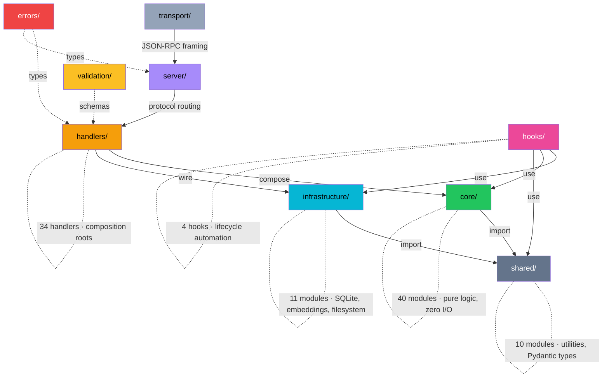

# Cortex — Architecture

## Layer Diagram

Handlers sit at the center as **composition roots**: they wire infrastructure (I/O) to core (logic) and are the only layer allowed to import both.

## Dependency Rules

| Layer | May Import | Must NOT Import |
|---|---|---|
| `shared/` | Python stdlib only | core, infrastructure, handlers, server, transport |
| `core/` | `shared/` only | infrastructure, handlers, server, transport, os/pathlib |
| `infrastructure/` | `shared/`, Python stdlib (pathlib, json, os) | core, handlers, server, transport |
| `validation/` | `shared/`, `errors/` | core, infrastructure, handlers |
| `errors/` | nothing | everything |
| `handlers/` | core, infrastructure, shared, validation, errors | server, transport |
| `server/` | handlers, errors | core, infrastructure (except via handlers) |
| `transport/` | server | everything else |
| `hooks/` | infrastructure, core, shared | server, transport |
| `__main__.py` | transport, server, handlers, infrastructure | — |

## Module Inventory

### `shared/` — Pure utilities (no I/O, no domain logic)

| Module | Purpose |
|---|---|
| `types.py` | Pydantic models: ProfilesV2, DomainProfile, CognitiveStyle, etc. |
| `text.py` | Keyword extraction with stopword filtering |
| `similarity.py` | Jaccard similarity coefficient for set comparison |
| `hash.py` | DJB2 non-cryptographic hash (8-hex-char fingerprints) |
| `categorizer.py` | 10-category work classification with pattern matching |
| `yaml_parser.py` | Lightweight YAML frontmatter parser for memory files |
| `project_ids.py` | Path <-> project ID <-> label <-> domain ID conversion |
| `linear_algebra.py` | Dense vector math via numpy (dot, norm, cosine, project, clamp) |
| `sparse.py` | Sparse vector operations (dict-based, top-K, conversions) |
| `memory_types.py` | Runtime validation types for the memory subsystem |

### `core/` — Pure domain logic (imports shared/ only)

#### Cognitive Profiling

| Module | Purpose |
|---|---|
| `domain_detector.py` | Three-signal weighted domain classification (project, content, category) |
| `context_generator.py` | Produces human-readable context paragraphs from structured profiles |
| `pattern_extractor.py` | Extracts entry points, recurring patterns, tool preferences, session shape |
| `style_classifier.py` | Felder-Silverman cognitive style classification from session behavior |
| `bridge_finder.py` | Cross-domain connection detection from structural edges and text analogies |
| `blindspot_detector.py` | Detects coverage gaps in cognitive domain profiles |
| `profile_builder.py` | Pure orchestration logic for building domain profiles from scan data |
| `graph_builder.py` | Constructs graph data structures for 3D visualization |

#### Behavioral Interpretability

| Module | Purpose |
|---|---|
| `sparse_dictionary.py` | Behavioral feature dictionary learning (OMP sparse coding, K-SVD) |
| `persona_vector.py` | 12D persona vector with drift detection and context steering |
| `behavioral_crosscoder.py` | Cross-domain behavioral feature persistence detection |
| `attribution_tracer.py` | Pipeline attribution graph via perturbation-based tracing |

#### Memory Thermodynamics

| Module | Purpose |
|---|---|
| `thermodynamics.py` | Heat, surprise, importance, valence, metamemory computation |
| `hierarchical_predictive_coding.py` | 3-level Friston free energy gate (sensory/entity/schema) |
| `coupled_neuromodulation.py` | DA/NE/ACh/5-HT coupled cascade with cross-channel effects |
| `oscillatory_clock.py` | Theta/gamma/SWR phase gating for encoding/retrieval/consolidation |
| `cascade.py` | Consolidation stages: LABILE → EARLY_LTP → LATE_LTP → CONSOLIDATED |
| `curation.py` | Active curation logic (merge, link, create decisions) |
| `engram.py` | Memory trace structure (Josselyn & Tonegawa 2020) |
| `decay_cycle.py` | Thermodynamic cooling with stage-dependent rates |
| `tripartite_synapse.py` | Astrocyte calcium dynamics, D-serine facilitation, metabolic gating |
| `pattern_separation.py` | DG orthogonalization + neurogenesis analog |
| `schema_engine.py` | Cortical knowledge structures with Piaget accommodation |
| `interference.py` | Proactive/retroactive interference detection + sleep orthogonalization |
| `homeostatic_plasticity.py` | Synaptic scaling + BCM threshold |
| `dendritic_clusters.py` | Branch-specific nonlinear integration + priming |
| `two_stage_model.py` | Hippocampal-cortical transfer protocol |
| `compression.py` | Full-text → gist → tag compression pipeline |
| `staleness.py` | File-reference staleness scoring against filesystem |
| `emergence_tracker.py` | System-level metrics: forgetting curve, spacing effect, schema acceleration |
| `ablation.py` | Lesion study framework for 20 ablatable mechanisms |

#### Consolidation

| Module | Purpose |
|---|---|
| `consolidation_engine.py` | Orchestrates decay, compression, CLS, causal discovery |
| `dual_store_cls.py` | Episodic → semantic memory consolidation (Complementary Learning Systems) |
| `causal_graph.py` | PC Algorithm for causal discovery between memories |
| `reconsolidation.py` | Memory updating on access (reconsolidation theory) |
| `replay.py` | Hippocampal replay for memory consolidation |
| `sleep_compute.py` | Dream replay, cluster summarization, re-embedding, auto-narration |

#### Retrieval & Navigation

| Module | Purpose |
|---|---|
| `query_router.py` | Intent classification (temporal/causal/semantic/entity) + 6-signal WRRF fusion |
| `hdc_encoder.py` | 1024D bipolar hyperdimensional computing (bind/bundle/permute/similarity) |
| `cognitive_map.py` | Successor Representation co-access graph + 2D projection |
| `hopfield.py` | Hopfield network for content-addressable recall |
| `fractal.py` | Hierarchical clustering (L0/L1/L2 levels) for fractal recall |
| `enrichment.py` | Doc2Query synthetic queries + concept synonym expansion |
| `sensory_buffer.py` | Bounded pre-consolidation ring buffer (working memory) |
| `knowledge_graph.py` | Entity and relationship extraction from memory content |
| `prospective.py` | Trigger-based proactive recall (keyword, time, file, domain) |
| `memory_rules.py` | Neuro-symbolic rules system (soft/hard filtering) |

#### Analysis & Narrative

| Module | Purpose |
|---|---|
| `narrative.py` | Story generation from memories |
| `metacognition.py` | Self-reflection on memory system performance |
| `session_critique.py` | Post-session analysis and improvement suggestions |
| `session_extractor.py` | Extracts memories from session transcripts |

### `infrastructure/` — Filesystem and persistence

| Module | Purpose |
|---|---|
| `config.py` | Centralized path constants via `pathlib.Path` |
| `file_io.py` | Generic JSON/text read/write with error handling |
| `scanner.py` | Data ingestion from `~/.claude/` — head/tail JSONL reading |
| `profile_store.py` | Persistence layer for methodology profiles |
| `session_store.py` | Persistence layer for the session log |
| `brain_index_store.py` | Persistence layer for the brain index |
| `mcp_client.py` | Async MCP client over stdio (JSON-RPC 2.0, version negotiation) |
| `mcp_client_pool.py` | Singleton connection pool (lazy connect, reuse, idle timeout) |
| `memory_store.py` | SQLite + FTS5 persistence layer for thermodynamic memories |
| `memory_config.py` | Runtime configuration (env vars with CORTEX_MEMORY_ prefix) |
| `embedding_engine.py` | Vector embeddings (64-dim default, configurable) |

### `validation/` — Input validation

| Module | Purpose |
|---|---|
| `schemas.py` | Per-tool input validation with type checking and defaults |

### `errors/` — Typed error hierarchy

| Module | Purpose |
|---|---|
| `__init__.py` | MethodologyError, ValidationError, StorageError, AnalysisError, McpConnectionError |

### `handlers/` — Tool composition roots (34 handlers)

#### Cognitive Profiling

| Module | Purpose |
|---|---|
| `query_methodology.py` | Returns cognitive profile for system prompt injection |
| `detect_domain.py` | Lightweight domain classification |
| `rebuild_profiles.py` | Full rescan of session data with smart caching |
| `list_domains.py` | Overview of all known domains |
| `record_session_end.py` | Incremental profile update + session logging |
| `get_methodology_graph.py` | Graph data for 3D visualization |
| `open_visualization.py` | Launches 3D visualization in browser |
| `explore_features.py` | 4-mode interpretability exploration |

#### Core Memory

| Module | Purpose |
|---|---|
| `remember.py` | Store memory through 4-signal predictive coding gate |
| `recall.py` | Retrieve memories via 6-signal WRRF fusion |
| `consolidate.py` | Run maintenance: decay, compression, CLS, sleep compute |
| `checkpoint.py` | Save/restore working state for hippocampal replay |
| `narrative.py` | Generate project narrative from memories |
| `memory_stats.py` | Memory system diagnostics |
| `import_sessions.py` | Import conversation history into memory store |
| `forget.py` | Hard/soft delete with is_protected guard |
| `validate_memory.py` | Validate memories against filesystem state |
| `rate_memory.py` | Useful/not-useful feedback → metamemory confidence |
| `seed_project.py` | 5-stage codebase bootstrap |
| `anchor.py` | Mark memory as compaction-resistant (heat=1.0) |
| `backfill_memories.py` | Auto-import prior Claude Code conversations |

#### Tier 2 — Navigation

| Module | Purpose |
|---|---|
| `recall_hierarchical.py` | Fractal L0/L1/L2 weighted recall |
| `drill_down.py` | Navigate into fractal cluster (L2 → L1 → memories) |
| `navigate_memory.py` | Successor Representation co-access BFS traversal |
| `get_causal_chain.py` | Trace entity relationships through knowledge graph |
| `detect_gaps.py` | Identify isolated entities, sparse domains, temporal drift |

#### Tier 3 — Automation

| Module | Purpose |
|---|---|
| `sync_instructions.py` | Push memory insights into CLAUDE.md |
| `create_trigger.py` | Prospective memory triggers (keyword/time/file/domain) |
| `add_rule.py` | Add neuro-symbolic hard/soft/tag rules |
| `get_rules.py` | List active rules by scope/type |
| `get_project_story.py` | Period-based autobiographical narrative |
| `assess_coverage.py` | Knowledge coverage score (0-100) + recommendations |
| `run_pipeline.py` | 11-stage ai-architect pipeline orchestrator |

### `server/` — Protocol layer

| Module | Purpose |
|---|---|
| `mcp_router.py` | MCP JSON-RPC dispatch with version negotiation and error boundary |
| `http_server.py` | Singleton HTTP server for visualization with idle timeout |

### `transport/` — I/O framing

| Module | Purpose |
|---|---|
| `stdio.py` | Async newline-delimited JSON-RPC 2.0 over stdin/stdout |

### `hooks/` — Session lifecycle

| Module | Purpose |
|---|---|
| `session_lifecycle.py` | SessionEnd hook for automatic profile updates from stdin JSON |
| `session_start.py` | SessionStart hook: injects anchored + hot memories + checkpoint state; auto-triggers backfill |
| `post_tool_capture.py` | PostToolUse hook: auto-captures important tool outputs as memories |
| `compaction_checkpoint.py` | Saves working state before context compaction |

### Entry point

| Module | Purpose |
|---|---|
| `__main__.py` | `python -m mcp_server` — FastMCP bootstrap, registers all 34 tools |

## Testing Strategy

**Framework:** `pytest` with `pytest-cov` for coverage, `pytest-asyncio` for async tests

**Runner:** `pytest tests_py/`

**Coverage:** `pytest --cov=mcp_server --cov-report=term-missing`

**Test commands by layer:**

| Command | Scope |
|---|---|
| `pytest` | All tests (1387 passing) |
| `pytest tests_py/shared/` | Shared utilities |
| `pytest tests_py/core/` | Core domain logic |
| `pytest tests_py/infrastructure/` | Infrastructure and I/O |
| `pytest tests_py/handlers/` | Handler composition roots |
| `pytest tests_py/server/` | MCP router |
| `pytest tests_py/transport/` | stdio transport |
| `pytest tests_py/hooks/` | Session lifecycle hooks |

**Coverage targets by layer:**

| Layer | Target | Rationale |
|---|---|---|
| `shared/` | 95%+ | Pure functions, easy to test exhaustively |
| `core/` | 90%+ | Pure logic, deterministic inputs/outputs |
| `errors/` | 100% | Trivial classes, full coverage is low effort |
| `validation/` | 95%+ | Schema edge cases must be exercised |
| `infrastructure/` | 85%+ | Filesystem mocking required |
| `handlers/` | 85%+ | Integration-style tests wiring core to infrastructure |
| `server/` | 80%+ | Protocol routing and error boundary coverage |
| `transport/` | 80%+ | I/O buffering and async framing |
| `hooks/` | 90%+ | Critical lifecycle automation |

**Test patterns:**
- Shared and core tests are pure unit tests with deterministic inputs
- Infrastructure tests use `tmp_path` fixture and `unittest.mock.patch`
- Handler tests mock infrastructure dependencies
- Server tests use in-memory JSON-RPC request/response cycles
- All async tests use `asyncio.get_event_loop().run_until_complete()` wrapper
