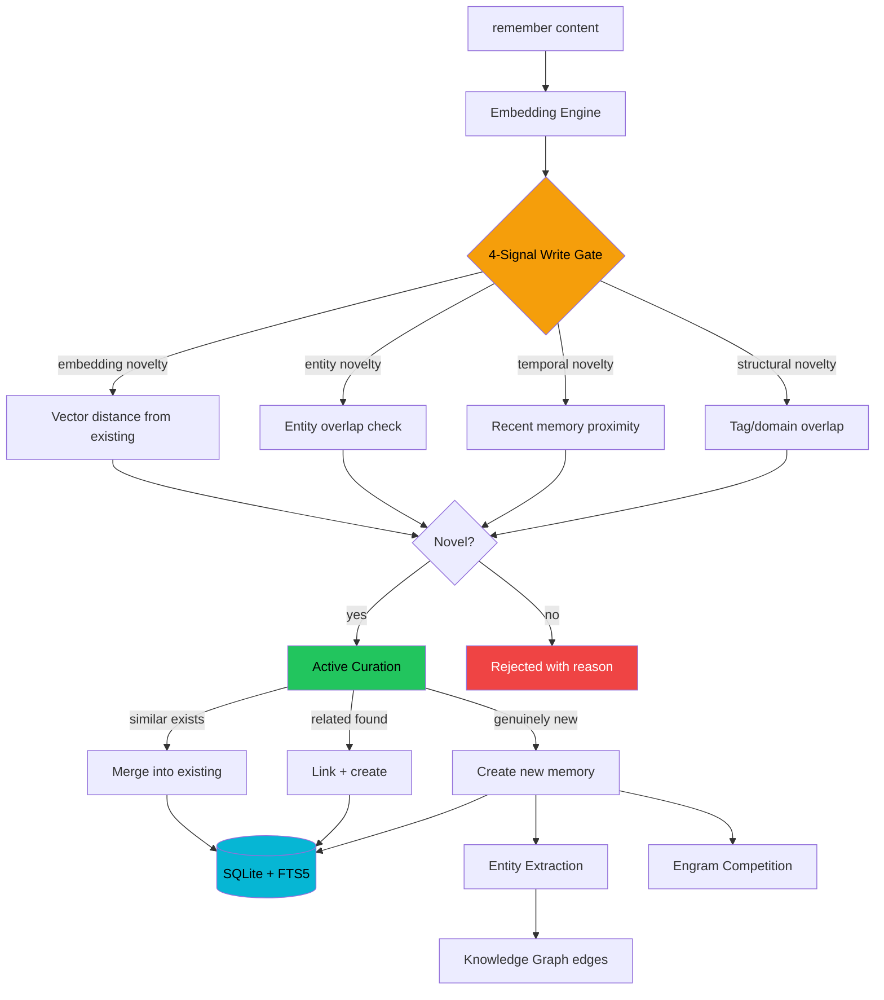
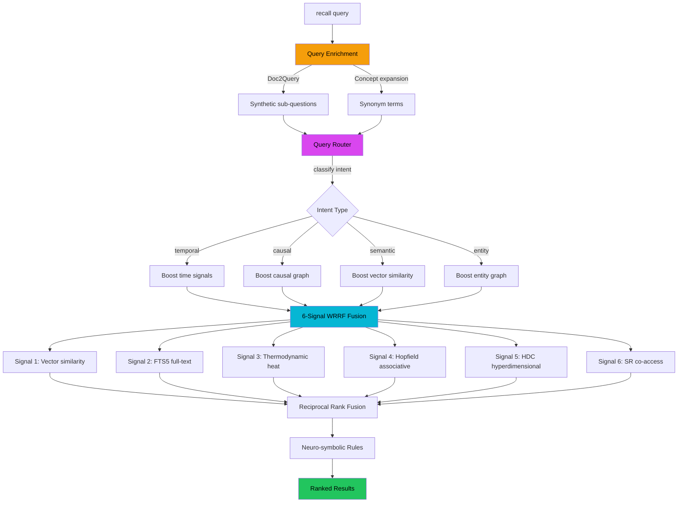
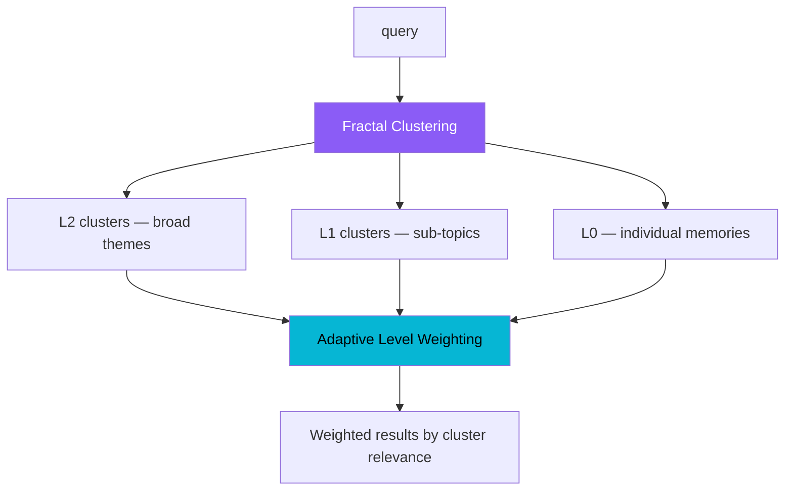
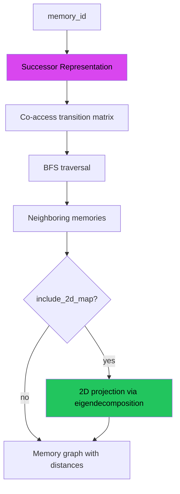
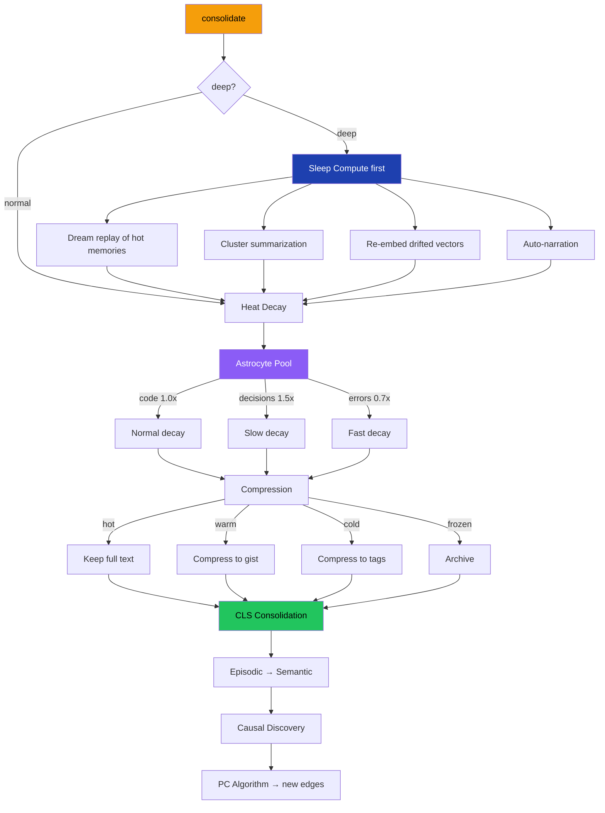
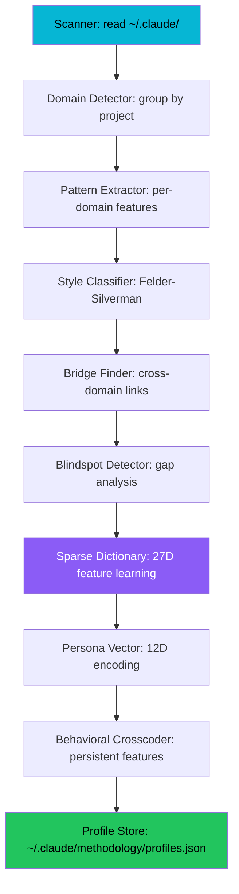

# JARVIS — Data Flow

## Memory Write Path (`remember`)

The write path uses a multi-stage pipeline to filter noise and maintain memory quality.



### Write Gate Signals

| Signal | Source | What it measures |
|---|---|---|
| Embedding | `embedding_engine.py` | Cosine distance from nearest existing memory vector |
| Entity | `knowledge_graph.py` | Overlap ratio of extracted entities with existing |
| Temporal | `thermodynamics.py` | Time gap from most recent memory in same domain |
| Structural | `curation.py` | Tag and domain overlap with existing memories |

The gate uses `JARVIS_MEMORY_SURPRISAL_THRESHOLD` (default 0.3) as the minimum combined novelty score. `force=True` bypasses the gate entirely.

## Memory Read Path (`recall`)

The read path uses intent-aware routing and multi-signal fusion.



### Retrieval Signals

| Signal | Module | What it measures |
|---|---|---|
| Vector similarity | `embedding_engine.py` | Cosine similarity between query and memory embeddings |
| FTS5 full-text | `memory_store.py` | SQLite FTS5 BM25 ranking |
| Thermodynamic heat | `thermodynamics.py` | Current heat value (recency + importance) |
| Hopfield associative | `hopfield.py` | Content-addressable recall via energy minimization |
| HDC hyperdimensional | `hdc_encoder.py` | 1024D bipolar hypervector similarity |
| SR co-access | `cognitive_map.py` | Successor Representation transition probabilities |

### Intent Classification

The query router classifies queries into four intent types, each with different signal weightings:

| Intent | Trigger keywords | Boosted signals |
|---|---|---|
| **temporal** | "when", "recently", "last week" | heat, FTS5 time filters |
| **causal** | "why", "because", "caused" | causal graph edges, entity graph |
| **semantic** | "what", "how", "explain" | vector similarity, HDC |
| **entity** | proper nouns, specific names | entity graph, knowledge graph |

## Hierarchical Recall Path (`recall_hierarchical`)



## Memory Navigation Path (`navigate_memory`)



## Consolidation Pipeline (`consolidate`)

Runs maintenance to keep the memory store healthy.



### Decay Rates (Astrocyte Pool)

| Memory Type | Decay Multiplier | Rationale |
|---|---|---|
| Code patterns | 1.0x (normal) | Standard baseline |
| Decisions | 1.5x (slow) | Decisions are hard-won and expensive to re-derive |
| Error details | 0.7x (fast) | Error specifics become stale quickly |

### Compression Stages

| Stage | Heat Range | Content |
|---|---|---|
| Full text | heat > 0.5 | Original content preserved |
| Gist | 0.1 < heat ≤ 0.5 | Summarized to key points |
| Tags | 0.01 < heat ≤ 0.1 | Reduced to tag set only |
| Archived | heat ≤ 0.01 | Frozen, excluded from active recall |

## Cognitive Profile Pipeline (`rebuild_profiles`)

The cognitive profiling pipeline transforms raw session history into structured profiles.



### Pipeline Stages

| Stage | Module | Output |
|---|---|---|
| 1. Scan | `infrastructure/scanner.py` | Raw session records from JSONL + memory .md files |
| 2. Group | `core/domain_detector.py` | Sessions grouped by domain (3-signal classification) |
| 3. Extract | `core/pattern_extractor.py` | Entry points, patterns, tool preferences, session shape |
| 4. Classify | `core/style_classifier.py` | Felder-Silverman scores (Active/Reflective, Sensing/Intuitive, Visual/Verbal, Sequential/Global) |
| 5. Bridge | `core/bridge_finder.py` | Cross-domain connections (structural + analogical) |
| 6. Detect gaps | `core/blindspot_detector.py` | Category, tool, and pattern gaps vs global averages |
| 7. Learn features | `core/sparse_dictionary.py` | Behavioral dictionary + OMP sparse activations |
| 8. Encode | `core/persona_vector.py` | 12D persona with drift detection |
| 9. Crosscode | `core/behavioral_crosscoder.py` | Persistent cross-domain features |
| 10. Store | `infrastructure/profile_store.py` | Persisted to profiles.json |

## Incremental Update Path (`record_session_end`)

Called at the end of each Claude Code session to update profiles without a full rescan.

1. **Append** to session log (capped at 1,000 entries)
2. **Running average** update for session shape (duration, turn count, burst ratio, exploration ratio)
3. **EMA update** for cognitive style dimensions (ADR-006)
4. **Tool preference decay** for unused tools; reinforcement for used tools

## Session Start Path (SessionStart Hook)

The `hooks/session_start.py` module runs at session start:

1. Load anchored memories (is_protected=True, heat=1.0)
2. Load hot memories above heat threshold
3. Load any saved checkpoint state
4. Check and fire prospective triggers (keyword, time, file, domain)
5. Auto-trigger backfill on fresh installs (no existing memories)

## AI Architect Pipeline (`run_pipeline`)

The 11-stage pipeline orchestrates ai-architect MCP calls:

```
init → discovery → impact → strategy → PRD → interview →
verification → implementation → HOR* → audit* → push/PR

* = NON_FATAL stages (failures don't halt the pipeline)
```

Each stage calls the ai-architect MCP server via `mcp_client_pool`, collects findings, and feeds them forward. Cognitive context from the methodology profile is injected into the strategy and PRD stages.
